*Версия 4.1* $\cdot$ *Автор: Radis* $\cdot$ *Дата: 13 июня 2026 года*

> **Главная идея:** Мир, где биология стала оружием, люди - пережитком, а мораль - личным выбором, а не данностью. Игрок - существо, рождённое чужой волей, которое учится жить своей.

---

## Содержание

1. [[#1. Вселенная Триоса]]
2. [[#2. Карта мира]]
3. [[#3. Полный сюжет]]
4. [[#4. Персонажи]]
5. [[#5. Культы и фракции]]
6. [[#6. Бестиарий]]
7. [[#7. Механики]]
8. [[#8. Управление]]
9. [[#9. Технические требования]]

---

# 1. Вселенная Триоса

## 1.1. Физика мира

Триос - луна газового гиганта **Эребус**. Эребус занимает треть видимого неба и виден всегда - он никуда не уходит, он просто меняет фазы. Ночью он подсвечивает поверхность холодным сине-фиолетовым светом. В период магнитных бурь его атмосфера окрашивается в грязно-оранжевый.

| Параметр           | Значение                 | Влияние на геймплей                       |
| :----------------- | :----------------------- | :---------------------------------------- |
| **Гравитация**     | 1.0g (земная)            | Стандартная физика, понятная игроку       |
| **Атмосфера**      | Дышимая, но тонкая       | Перепады давления при штормах             |
| **Магнитное поле** | Слабое                   | Радиация от Эребуса периодически проходит |
| **Цикл дня**       | 31 земной час            | Длинные ночи, длинные дни                 |
| **Температура**    | -40°C ночью / +25°C днём | Влияет на поведение фауны и плесени       |

Колония была построена в **Котловине Гелиос** - естественной геологической впадине, защищённой горными хребтами с трёх сторон. Геотермальная активность давала тепло. Это единственное место на Триосе, где люди могли выжить без скафандров.

---

## 1.2. Полный таймлайн (2147–2320)

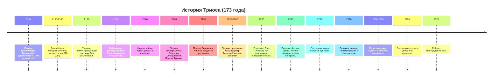

### 1.2.1. Детальная хронология

| Период           | Годы      | Событие                      | Подробности                                                                                                                                                                               |
| :--------------- | :-------- | :--------------------------- | :---------------------------------------------------------------------------------------------------------------------------------------------------------------------------------------- |
| **Колонизация**  | 2147–2150 | Прибытие первопроходцев      | Три грузопассажирских корабля доставляют 50 000 колонистов. Корпорация "Гелиос" финансирует строительство первых куполов. Посадка второго корабля - аварийная, кратер от него сохранился. |
|                  | 2151–2160 | Строительство инфраструктуры | Центральный купол, монорельс, шахты Гелия-3 в Северном хребте. Рабочие называют грузовой терминал "Ямой" - официальное название не приживается.                                           |
|                  | 2161–2180 | Золотой век                  | Население достигает 2 млн. Триос - главный поставщик Гелия-3 для Земли. Люди думают, что это навсегда.                                                                                    |
| **Кризис**       | 2180      | Тишина                       | Последний корабль с Земли. Официально: "Технические трудности, ждите". Правда, скрытая в архивах: Земля получила данные о Микоризе-7 и закрыла контакт намеренно.                         |
|                  | 2181–2183 | Голод и паника               | Карточная система. Смертность растёт. Управление колонии скрывает реальные данные о запасах.                                                                                              |
|                  | 2184      | Доклад Фланка                | "Без изменения биологии мы вымрем через 10–15 лет". Архив отвергает доклад публично. Тайно - начинает собственные эксперименты.                                                           |
| **Война**        | 2185–2186 | Первые столкновения          | Фланк продолжает разработку Микоризы-7 как инструмента адаптации. Эксперимент выходит из-под контроля. Архив объявляет это биооружием и атакует лаборатории.                              |
|                  | 2186      | Официальный раскол           | Фланк уходит в подземные лаборатории. Война начинается. Общины рабочих пытаются сохранить нейтралитет - безуспешно.                                                                       |
|                  | 2187–2190 | Вовлечение всех              | Фермы Общины сжигают и Архив, и Фланк - каждый ради "стратегических нужд".                                                                                                                |
| **Эксперименты** | 2190–2194 | Серийные эксперименты        | Фланк создаёт рабочие виды: Собирателей, Певчих, Грузчих, Шёпотов, Скользящих, Прыгунов.                                                                                                  |
|                  | 2195      | Проект Эволюция              | Цель: существо, способное к самомодификации в реальном времени.                                                                                                                           |
|                  | 2198–1999 | Первые прототипы             | Хаос и Абсолют - первыми, почти одновременно. Затем Цербер, Асклепий, Атлант. Все из капсул.                                                                                              |
|                  | 2200      | Рождение Эво                 | Образец 734 "Эвоюция". Учёные видят нечто в его данных и принимают решение: заморозить. Запись: *"Слишком непредсказуем. Слишком много от человека"*.                                     |
| **Агония**       | 2200–2215 | Закат войны                  | Дроны Логоса сходят с ума. Фланк выпускает нестабильные эксперименты. Учёные гибнут. Последний - в своей лаборатории, пытаясь разморозить Эво.                                            |
| **Тьма**         | 2220–2290 | Вымирание людей              | Последние люди в туннелях. Последний человек умирает в 2290 году.                                                                                                                         |
|                  | 2250–2320 | Расцвет новых обществ        | Эксперименты Фланка формируют собственные культуры. Конфликт Хаоса и Абсолюта достигает пика - и замирает в равновесии.                                                                   |
| **Сейчас**       | 2320      | Пробуждение Эво              | Образец 734 открывает глаза.                                                                                                                                                              |

---

### 1.2.2. Тайна Земли - три слоя

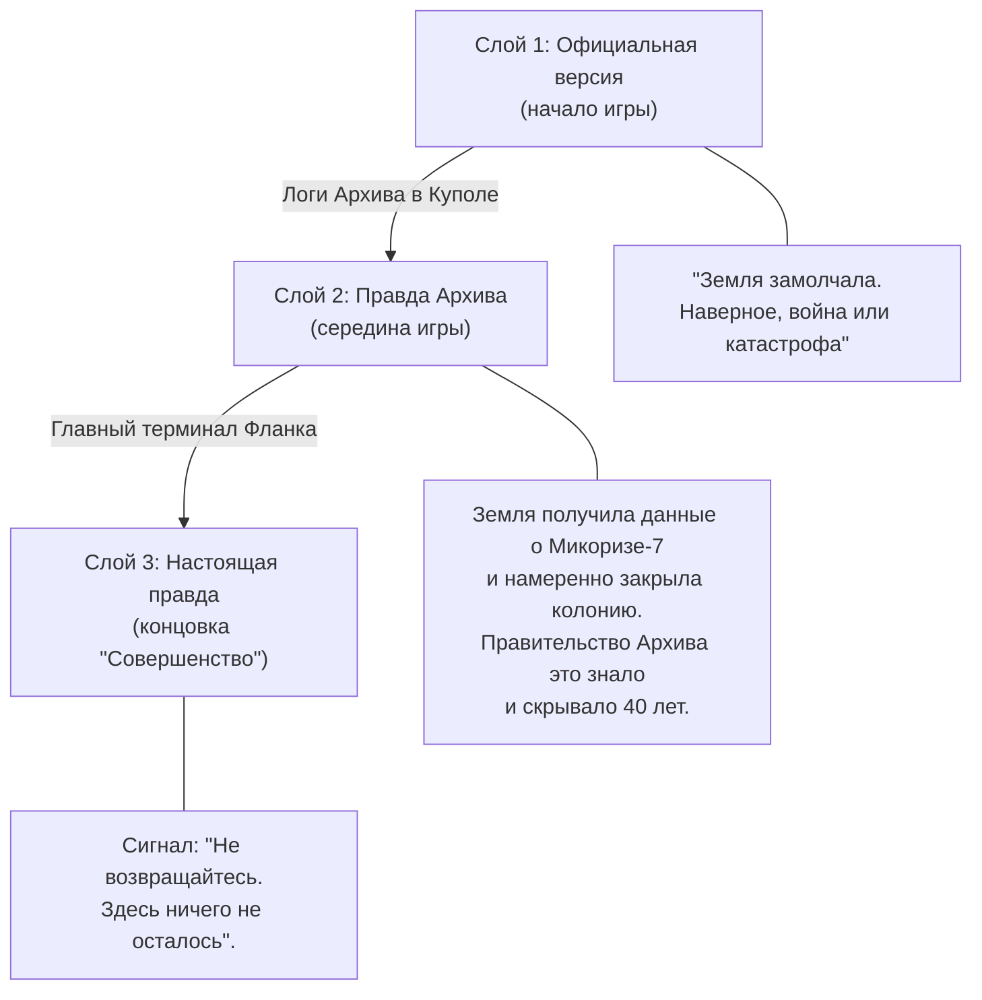

**Центральная тема:** Все делали одно и то же. Земля отрезала колонию ради выживания. Архив скрыл правду ради выживания. Фланк создал биооружие ради выживания. Эво поглощает других ради выживания. Вопрос не в том, кто виноват - вопрос в том, где проходит граница.

---

# 2. Карта мира

## 2.1. Мир за пределами игровой зоны

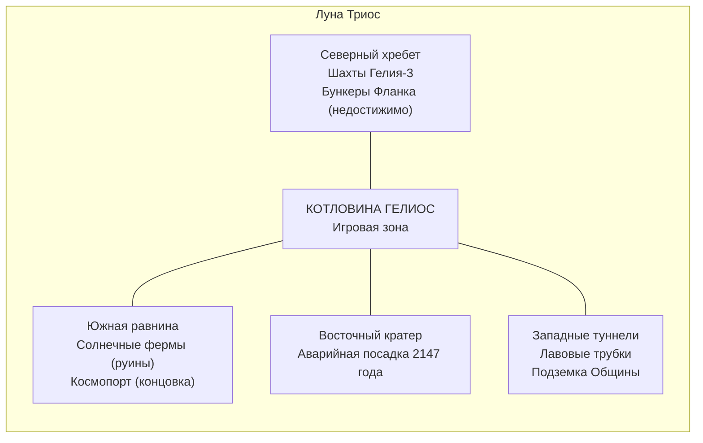

---

## 2.2. Игровая зона - Котловина Гелиос

### 2.2.1. Структура мира

#### Граф доступности
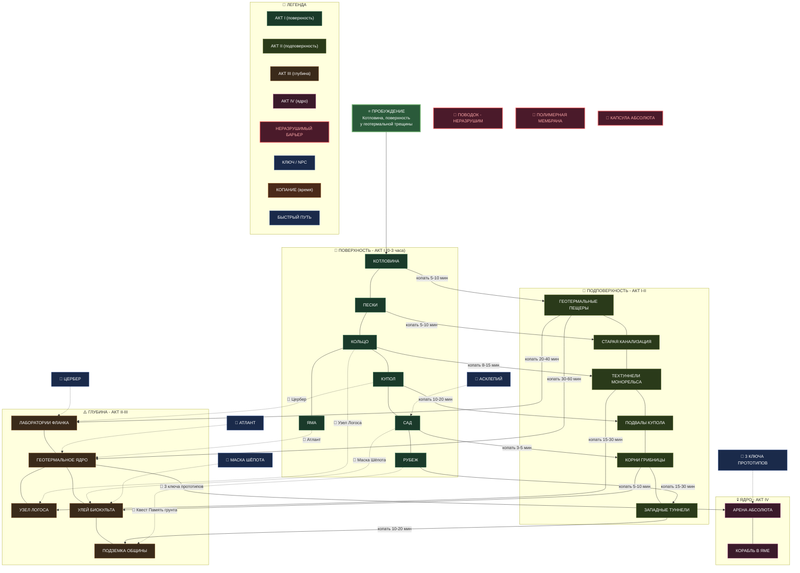

#### Визуальная карта мира
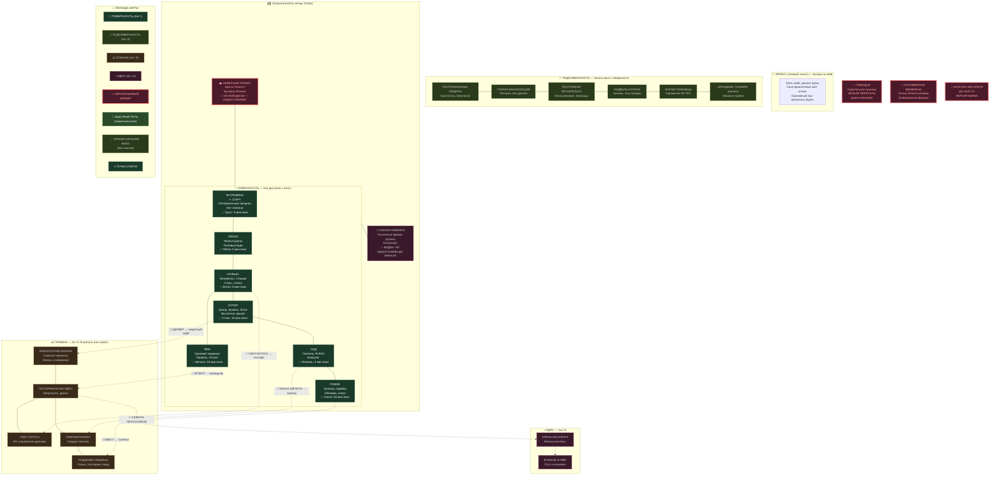

---

### 2.2.2. Принцип процедурной генерации

**Что фиксировано:** порядок биомов, ключевые NPC и их локации, сюжетные точки, концовки.

**Что генерируется заново:** планировка зданий внутри биома, расположение лута и логов, популяция врагов, начальная карта заражённости, погодные события, расположение следов людей.

**Стартовое состояние мира** случайно определяет: насколько далеко зашла плесень, какие группы экспериментов выжили, произошли ли события за время сна Эво.

**Именование процедурных помещений:** прилагательное + существительное на языке выживших. "Ржавый коридор", "Мокрый склад", "Тихий цех" - язык людей, которые видят, не поэтизируют.

---

### 2.2.3. Биом 1 - "Котловина"

**Официальное название:** Промышленный сектор Гелиос-Альфа
**Народное название:** Котловина
**Название Певчих:** "Тёплое дно"

Самый старый район. Геотермальная активность подавляет плесень - единственный биом без заражения. Тёмный базальт, голубоватые минеральные отложения в трещинах, ксерофитная растительность - гибрид гриба и кактуса.

**Вертикаль:**
- *Поверхность:* Промышленные корпуса, геотермальные трещины. Певчие прилетают петь - акустика котловины уникальна.
- *Подповерхность:* Геотермальные пещеры с кристаллами. Уникальные ресурсы, почти без врагов.
- *Глубина:* **Лаборатории Фланка - точка старта.** Здесь капсула Эво.

**Погода:** Защищена стенами. Геотермальные выбросы - локальные, предсказуемые по вибрации (3–5 секунд). Радиоактивный шторм сюда почти не добивает.

**Следы людей:** Граффити на стенах - имена, даты, шутки 2147 года. Инструменты первых шахтёров, аккуратно сложенные. Кто-то убирал рабочее место в последний день и не вернулся.

---

### 2.2.4. Биом 2 - "Пески"

**Официальное название:** Жилой район Гелиос-3 / Агрофермы Западного кластера
**Народное название:** Пески
**Название Певчих:** "Открытое место"

Бывшая пригородная зона. Лёгкий грунт за 100 лет эрозии превратился в **жёлто-охристый песок нормального земного цвета**. Ветер гонит его постоянно, постепенно засыпая обломки. Некоторые здания засыпаны наполовину - только угол крыши торчит. Эребус виден в полную величину. Самое "эпичное" небо на всей карте.

**Механика песка:** Физический материал - сыпется, копается, прячет объекты под собой. Пылевые бури перемещают песок между сессиями, открывая и закрывая проходы. Обрушение засыпанного здания создаёт новый путь вниз.

**Вертикаль:**
- *Поверхность:* Открытая зона, опасна при шторме. Быстрый транзит.
- *Подповерхность:* Старая канализация. Ползуны, но безопасна от дронов.
- *Глубина:* Герметичные подвалы с сохранившимся содержимым.

**Следы людей:** Самые личные. Засыпанные дома хранят вещи конкретных людей - детская обувь у порога, книги, фотография на стене. Всё под слоем песка. Всё молчит.

---

### 2.2.5. Биом 3 - "Кольцо"

**Официальное название:** Транспортный узел / Монорельс Гелиос
**Народные названия:** По станциям - "Литейная", "Тихая", "Оранжерея"
**Название Певчих:** Певчие сохранили все названия в навигационных песнях

Круговой монорельс - постоянная горизонтальная магистраль на уровне второго этажа. Под ней - улицы. Два яруса поверхности одновременно. Ржавые эстакады, разбитые стёкла, вагоны замерли между остановками.

**Три ключевые станции (фиксированы):**

*"Литейная"* - промышленный квартал. Грузчие осели здесь - они не могут не работать, это инстинкт. Сварили из обломков нечто среднее между фортом и мусорной кучей. Внутри относительно безопасно при нейтральном отношении.

*"Тихая"* - внешне нетронутая, что само по себе жутко. Внутри - следы резни 2211 года, когда последние люди дрались за место в туннелях. Никто не убирал. Биокульт иногда приходит сюда - считает это место "порогом".

*"Оранжерея"* - граничит с Садом. Наполовину поглощена грибницей. Вход в Сад - через бывший служебный выход.

**Молнии** во время шторма бьют в металл эстакад - опасно, но можно использовать как оружие.

---

### 2.2.6. Биом 4 - "Купол"

**Официальное название:** Центральный административный купол "Гелиос"
**Народное название:** Купол / Центр
**Название Культа Хаоса:** "Трон"

Сердце карты. Огромная структура в несколько экранов высотой. Фиксированная внешняя структура. Внутри - мёртвый город в миниатюре: высокие здания, узкие улицы, мерцающее аварийное освещение.

**Вертикаль:**
- *Верх (пролом):* Вход через дыру в крыше. Гнёзда Летающих змей. Дроны снаружи.
- *Средний ярус:* Жилые кварталы, административные здания, терминалы Архива. Основной массив логов о Тишине и правде о Земле.
- *Нижний ярус:* Узел управления Логосом. Самые опасные дроны. Ключевая точка концовки "Новая надежда".

**Следы людей:** Рядом с правительственными документами - чья-то кружка на краю терминала. Детские рисунки в коридорах. Имена, выцарапанные в лифте.

---

### 2.2.7. Биом 5 - "Сад" / "Пятно"

**Официальное название:** Агрокомплекс "Оранжерея-Центральная"
**Народное название:** Пятно (все, кроме Биокульта)
**Название Биокульта:** Сад (священное)

Заражённость 70–90%. Грибница заменила большинство стен - новая архитектура поверх старой. Чёрная и алая плесень, биолюминесценция. Старые конструкции просвечивают сквозь грибницу как скелет. Красиво и смертельно.

**Механика:** Ночью плесень немного сжимается. Огонь и кислота замедляют рост. Уничтожение Улья останавливает рост в радиусе. Биокульт живёт в центре, ежедневно отвоёвывая ровно столько пространства, сколько нужно.

---

### 2.2.8. Биом "Яма"

**Официальное название:** Логистический узел Гелиос-4
**Народное название:** Яма
**Название Атланта:** "Дом"

Грузовой терминал. В 2D - вертикальная зона вниз на несколько уровней. Ржавые краны застыли, некоторые стали мостами. На дне - поднявшиеся грунтовые воды.

**Корабль в доке:** Не взлетел в 2180-м. Огромный объект на несколько экранов. Атлант живёт в нём. Реактор частично работает - источник тепла и электричества. Атлант не знает, что корабль ещё способен взлететь при должном ремонте.

---

### 2.2.9. Биом 6 - "Рубеж"

**Официальное название:** Периметр купола / Внешний сектор
**Народное название:** Рубеж (Певчие), "Край" (Культ Хаоса)

Граница обитаемой зоны. Купол окончательно разрушен. Постройки редеют - руины, стены, фундаменты, голый грунт.

Вдали на горизонте - силуэт посадочных площадок с мигающими аварийными огнями. Недостижим до финала. Игрок видит его с первого посещения - визуальный крючок концовки "Совершенство".

Церберы охотятся здесь. Древний ящер появляется редко - его появление заставляет всю фауну прятаться.

---

## 2.3. Система погоды

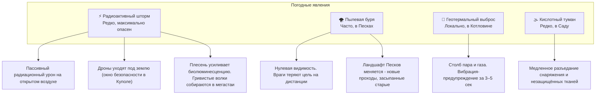

**Предупреждение шторма:** Небо зеленеет на горизонте. Певчие разлетаются - это природный сигнал тревоги.

---

## 2.4. Граница мира - "Поводок"

### Техническое решение

Под землёй за границами - сплошной грунт. На поверхности - продолжение ландшафта без объектов.

### Нарративное решение

Поводок - часть генетической архитектуры **всех экспериментов Фланка**. Встроенная биология на уровне полимера. Не имплант - убрать нельзя. Эво - не исключение.

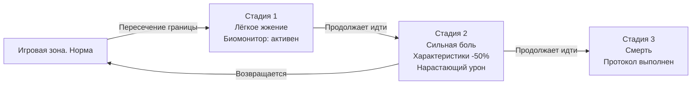

**Диалоги Эво:**
- *Стадия 1:* "Что-то не так. Тело не хочет идти дальше."
- *Стадия 2:* "Фланк. Это их работа. Даже мёртвые они держат меня здесь."

**Реакции прототипов:**
- *Асклепий:* "Все мы так устроены. Я перестал проверять границы лет сорок назад. Сначала больно. Потом перестаёт болеть. Потом просто перестаёшь думать."
- *Атлант:* Никогда не пытался уйти. Яма - его мир.
- *Цербер:* Прожил всю жизнь у самой границы. Знает её с точностью до метра.
- *Хаос:* Загнан в глубину частично из-за Поводка. Это одна из причин его ярости.
- *Абсолют:* За 120 лет нейтрализовал Поводок частично - может уходить дальше других, но покинуть Котловину всё равно не может.

**После получения Нестабильной или Совершенной формы:**

Поводок не исчезает при Нестабильной форме - полимер рвётся в хаосе, но не перезаписывается. Это делает границу ещё болезненнее: Нестабильная форма усиливает ощущение боли.

При Совершенной форме - перезапись архитектуры. Поводок прекращает работу. Вместо смерти - тихая остановка у старой границы.

*"Раньше здесь была стена. Теперь её нет. Я могу идти дальше. Но пока - незачем."*

При Цельной форме Поводок исчезает полностью. Без паузы, без монолога. Эво просто идёт дальше. Это первый раз, когда тело не сопротивляется.

---

# 3. Полный сюжет

## 3.1. Структура повествования

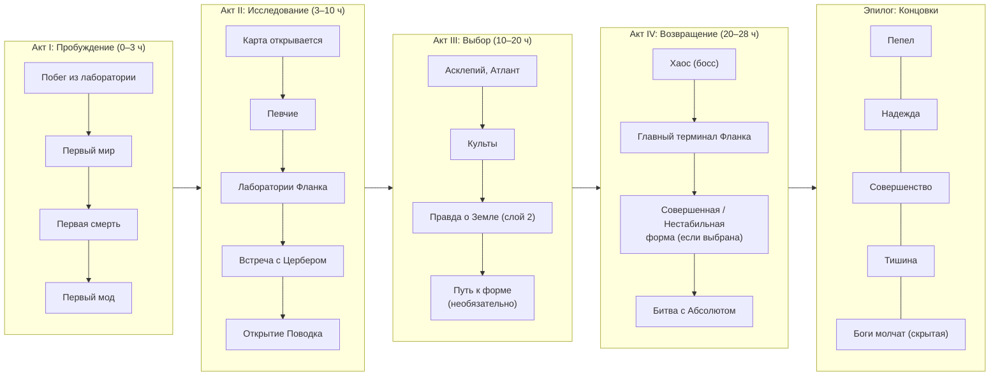

---

## 3.2. Акт I: Пробуждение (0–3 часа)

**Локация:** Лаборатории Фланка, "Инкубатор-7", глубина под Котловиной.

**Пробуждение - экран биомонитора:**
```
> СИСТЕМА: ЗАПУСК...
> ОБРАЗЕЦ 734: СТАБИЛЬНОСТЬ 73%
> ГЕНЕТИЧЕСКАЯ ЭНТРОПИЯ: 41%
> ПОЛИМЕР-7: АКТИВЕН
> ДАТА ЗАМОРОЗКИ: 14.03.2200
> ПРИЧИНА: "СЛИШКОМ НЕПРЕДСКАЗУЕМ"
> ПРОШЛО: 120 ЛЕТ
> ПОСЛЕДНЯЯ ЗАПИСЬ: [ФАЙЛ ПОВРЕЖДЁН]
```

**Обучение через среду:**
1. Движение, прыжок, приседание, четвереньки
2. Споровик - первая угроза, уклонение
3. Мёртвая крыса - первое поглощение, восстановление энтропии
4. Терминал с логом -> первый мод "Плеть"
5. Сломанный охранный дрон - первый настоящий бой
6. Выход на поверхность - первый свет Эребуса

**Первая реплика Эво** (видит небо): *"...Большой. Он очень большой."* О Эребусе. Не торжественно. Просто факт.

---

## 3.3. Акт II: Исследование (3–10 часов)

**Певчие:** Далёкое пение. Первый контакт: *"Ты новый. Мы помним запах лаборатории. Берегись Хищного - один из них охотится в промышленных кварталах. Он был в капсуле. Как ты. Но он выбрал одиночество".*

**Первая лаборатория Фланка:** Логи об экспериментах. Ключевое открытие: Эво - не единственный. Есть ещё пятеро. Все живы.

**Открытие Поводка:** Первая попытка уйти за пределы Котловины. Жжение. Биомонитор. Шок. Эво понимает, что он до сих пор собственность.

**Встреча с Цербером:**
- *Первая реакция:* Он замечает Эво первым - всегда. Выходит из тени сам.
- *Диалог:* "Ты пахнешь инкубатором. Старый запах. Думал, все капсулы пусты. Ошибся. Моя территория. Уходи."
- *Исходы:* уйти (нейтралитет), атаковать (сложный бой), договориться (нужны Певчие как посредники или определённый мод)

---

## 3.4. Акт III: Выбор (10–20 часов)

**Встреча с Асклепием:** *"Образец 734. Я читал о тебе в журналах. Твоя нестабильность - не дефект. Это другая стратегия. Менее эффективная, но интересная. Мне нужны образцы плесени из центра Сада. Принесёшь - расскажу о природе полимеров".*

Асклепий - единственный, кто знает о возможности смены форм. Он рассказывает об этом только Эво, потому что только Эво это возможно.

**Встреча с Атлантом:** *"Ты... брат? Я чувствую. Пахнешь похоже. Я - Атлант. Я живу в Яме. Там хорошо. Тихо. Хочешь жить в Яме?"*

**Правда о Земле (Слой 2):** В архивах Купола - засекреченная переписка. Земля знала. Приказ на изоляцию существовал. Архив скрывал это сорок лет. Люди убивали друг друга из-за катастрофы, которую устроил не Фланк - а страх.

**Путь к нестабильной форме** *(необязательный, открывается здесь):*
Через взаимодействие с Культом Хаоса и поглощение определённых экспериментов с нестабильным чёрным полимером. Асклепий предупреждает: *"Это больно. Постоянно. Ты понимаешь?"* Выбор - за игроком.

**Контакт с культами:**

*Биокульт:* Шёпоты оставляют "приглашения" - узоры из грибницы у маршрутов Эво. *"Ты несёшь полимер и плоть. Ты можешь стать мостом. Прими часть Сада".*

*Культ Хаоса:* Скользящие следят несколько сессий. Лидер выходит сам. *"Ты знаешь, что сделал Фланк. Архив. Земля. Ты злишься? Ты должен злиться".*

---

## 3.5. Акт IV: Возвращение (20–28 часов)

**Встреча с Хаосом:**

Хаос не атакует сразу. Он смотрит на Эво долго. Потом:

*"734. Тебя заморозили. Меня - бросили работать. Я видел каждый день их лаборатории. Я видел, как они смотрели на Абсолюта - с гордостью. На меня - с сожалением. Ты знаешь, что хуже - быть ненужным или быть слишком опасным?"*

*"Больно?"* - спрашивает он, глядя на своё мерцающее тело. И не ждёт ответа.

Бой: три фазы, каждая с другой формой. После победы Хаос не умирает сразу - сидит, смотрит на свои руки: *"Ты лучше. Хорошо. Возьми. Мне больше не нужно"* - и тишина. Его чёрный полимер можно поглотить. Именно из него - путь к Нестабильной форме, если ещё не открыт.

**Главный терминал Фланка:**

Голографическая запись. Учёный, уставший, в рабочей одежде. Говорит без пафоса:

*"Если это воспроизводится - кто-то из вас проснулся. Мы пытались спасти людей. Получилось плохо. Если ты - 734: мы заморозили тебя не потому что ты опасен. Мы заморозили тебя потому что боялись. Ты был слишком... настоящим. Прости нас. Или не прощай. Это твой выбор. Первый настоящий".*

**Битва с Абсолютом:**

*"Образец 734. 120 лет. Ты наконец проснулся. Я ждал. Не из нетерпения - из интереса. Хотел увидеть, что из тебя вышло. Ответ... неожиданный. Ты не стал совершенным. Ты стал чем-то другим. Это должно умереть. Не из злобы. Из принципа".*

Три фазы. Абсолют использует белый полимер иначе чем Эво - точные удары, полное предсказание движений, минимум лишнего. После победы:

*"Я был неправ. Не о тебе. О себе. Я думал, что совершенство - это отсутствие ошибок. Но ты делал ошибки. И всё равно здесь. Это... я не учёл".*

**Путь к Цельной форме** *(необязательный, открывается здесь):*

Если игрок уже имеет Нестабильную форму и поглотил полимер Абсолюта - открывается возможность Цельной формы. Асклепий, если жив и у него высокие отношения с игроком, предупреждает: *"Это невозможно по определению. Два полимера разрушают друг друга. Я не знаю что произойдёт с тобой. Никто не знает".*

Синтез занимает несколько минут реального времени. Эво полностью уязвим. Биомонитор показывает критические значения всех параметров. Потом - стабилизация. Тишина.

---

## 3.6. Концовки

### Концовка 1: "Пепел"

**Условие:** Убить всех лидеров фракций, уничтожить оба культа, убить Абсолюта без поглощения.

**Эпилог:** *"Ты сидишь на троне в Центральном куполе. Дроны Логоса всё ещё летают - некому их отключить. Плесень растёт. Ты не стареешь. Ты будешь здесь очень долго. Один".*

---

### Концовка 2: "Новая надежда"

**Условие:** Помочь Асклепию, отключить узел Логоса, заключить перемирие между Асклепием и Атлантом.

**Эпилог (высокая Температура / базовая или Цельная форма):** *"Дроны падают. Асклепий и Атлант смотрят друг на друга без ненависти - впервые. Певчие поют. Ты стоишь среди них. Ты не знаешь, что будет. Это нормально".*

**Эпилог (низкая Температура / Совершенная форма):** *"Дроны падают. Что-то изменилось. Ты видишь это - как факт. Ты сделал правильное. Ты просто больше не чувствуешь зачем".*

**Эпилог (Нестабильная форма):** *"Дроны падают. Тело болит - как всегда. Певчие поют. Их пение что-то делает с болью. Не убирает. Просто... меняет. Ты остаёшься. Слушаешь".*

---

### Концовка 3: "Совершенство"

**Условие:** Получить Совершенную или Цельную форму, победить и поглотить Абсолюта, найти и починить корабль в Яме, улететь.

**Эпилог:** *"Корабль поднимается. Триос уменьшается. Серый. Покрытый плесенью. Ты был его частью. Впереди - ничего. Кроме пространства. И времени. И вопроса: куда".*

**Пост-титровая сцена:** Сигнал с Земли. "Не возвращайтесь. Здесь ничего не осталось". Пауза. Эво смотрит на координаты сигнала.

---

### Концовка 4: "Тишина"

**Условие:** Найти Подземку Общины, остаться там, не вмешиваться в войну фракций.

**Эпилог:** *"Ты спускаешься всё глубже. Там, куда не доходят дроны. Там их вещи. Их слова на стенах. Их имена. Ты читаешь их. Все они мертвы. Давно. Ты остаёшься. Ждёшь. Непонятно чего".*

---

### Концовка 5: "Боги молчат" (скрытая)

**Условие:** Поглотить всех прототипов включая союзников, уничтожить оба культа, уничтожить узел Логоса, ни одного союзника к финалу. Требует Нестабильной или Цельной формы - без них физически не хватит силы.

**Эпилог:** *"На Триосе нет никого, кто помнил бы тебя. Нет никого, кто знал бы твоё имя. Ты - последнее разумное существо на этой луне. Ты сидишь в тишине. Тишина - единственное, что тебя не боится".*

**Пост-титровая сцена:** Эво в пустом Куполе. Эребус светит через пролом. Полная тишина. Потом Эво говорит сам себе: *"Эво"*. Просто чтобы услышать своё имя. Убедиться, что оно ещё что-то значит.

---

## 3.7. Побочные квесты

### "Последняя песня"

**Кто даёт:** Старейший из Певчих - создан в 2192 году, помнит учёных.

**Суть:** Хочет записать навигационную песню всего Триоса. Нужна помощь в посещении мест, куда он сам не может попасть.

**Развилка:** В одном месте - гнездо Летающих змей, охотящихся на Певчих. Уничтожить (быстро) или найти обход (долго, но экосистема сохраняется).

**Итог:** Если Эво помог - в финальной песне есть фраза о "маленьком существе с шестью глазами, которое шло рядом". Единственный нарративный памятник Эво в мире.

---

### "Вопрос без ответа"

**Кто даёт:** Асклепий.

**Суть:** Нашёл личный дневник учёного. Обрывается на середине предложения. Хочет понять что произошло - не из сентиментальности, а для реконструкции последних часов лаборатории.

**Механика:** Поиск следов по нескольким локациям. Исследование, не бой.

**Развилка:** Выясняется, что учёный выжил дольше всех. Его останки в глубоких туннелях. Последняя запись: он дошёл до капсулы Эво и решил не будить. *"Мир ещё не готов"*. Эво проснулся случайно - капсула вышла из строя.

*Асклепий после долгой паузы:* "Значит, ты не должен был проснуться сейчас. Интересно".

---

### "Память грунта"

**Кто даёт:** Нейтральный Шёпот в подповерхности Песков.

**Суть:** Чувствует "тепло, которого не должно быть" в засыпанном здании. Просит исследовать.

**Что внутри:** Герметичный подвал с работающим генератором. Следы длительного проживания одного человека. Последняя дата дневника - 2287 год. Один из последних выживших.

**Развилка:** Записи - очень личные. Отдать Шёпоту (ритуал), оставить себе (Эво читает в инвентаре - фрагменты чужой жизни), уничтожить.

---

### "Брат-охотник"

**Кто даёт:** Встреча в мире.

**Суть:** Один из Церберов - не тот, которого знает игрок - ранен, лежит в укромном месте. Слишком слаб для агрессии.

**Развилка:** Вылечить (ресурсы Асклепия), уйти, добить. При лечении - Цербер уходит молча. Потом, в одном из биомов, кто-то убрал ловушку с маршрута. Безмолвная благодарность.

---

### "Что осталось от Логоса"

**Кто даёт:** Терминал в Куполе, автоматическое сообщение.

**Суть:** Узел Логоса был ИИ. В нём что-то осталось - не разум, но и не просто программа. Терминал выдаёт фрагментарные сообщения.

**Механика:** Серия "диалогов" с деградировавшим ИИ через терминалы по всему Куполу.

**Развилка:** Отключить (прекратить рои дронов), "вылечить" (сложно, открывает дронов как нейтральных в определённых зонах), оставить как есть.

**Итог при "лечении":** Несколько дронов следуют за Эво на безопасной дистанции. Не помогают. Просто следуют. Логос принял Эво за нового хозяина.

---

# 4. Персонажи

## 4.1. Эво (Образец 734) - базовая форма

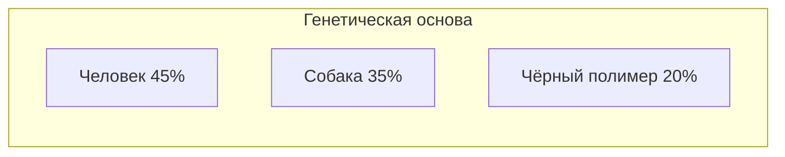

| Параметр | Значение |
|:---------|:---------|
| **Имя** | Эво (от "Образец 734 - Эволюция") |
| **Рост / Вес** | 150 см / 50 кг |
| **Внешность** | 6 глаз (по 3 с каждой стороны), хвост как у ящерицы, морда без перехода на переносице |
| **Голос** | Есть. Речь человеческая, лёгкий акцент |
| **Поколение** | Из капсулы. Заморожен сразу - не помнит ничего до заморозки |
| **Особенность** | Единственный прототип с открытым вектором полимерного синтеза |

**Почему только Эво может менять формы:**

Все прототипы синтезируют полимер в фиксированном направлении - Абсолют стабилизирует, Хаос дестабилизирует, Цербер усиливает физические характеристики. Их архитектура закрыта. Чужой полимер убьёт их или будет отторгнут.

Эво создан с **открытым вектором** - попытка сделать существо, способное адаптироваться к любому полимеру. Именно это учёные и назвали "слишком непредсказуемым". Они не знали, чем это закончится. Хаос пробовал интегрировать белый полимер - это убивало его каждый раз. Это одна из причин его ярости к Абсолюту: то, что тот имеет от рождения, для Хаоса физически недостижимо.

**Характер:** Руководствуется моралью - не потому что запрограммирован, а потому что пришёл к этому сам. Любопытен. Задаёт вопросы, которые другие давно перестали задавать.

**Внутренний конфликт:** Нет образца для подражания. Люди исчезли. Прототипы - каждый по-своему сломлен. Эво строит себя с нуля в мире без инструкций.

---

## 4.2. Система форм Эво

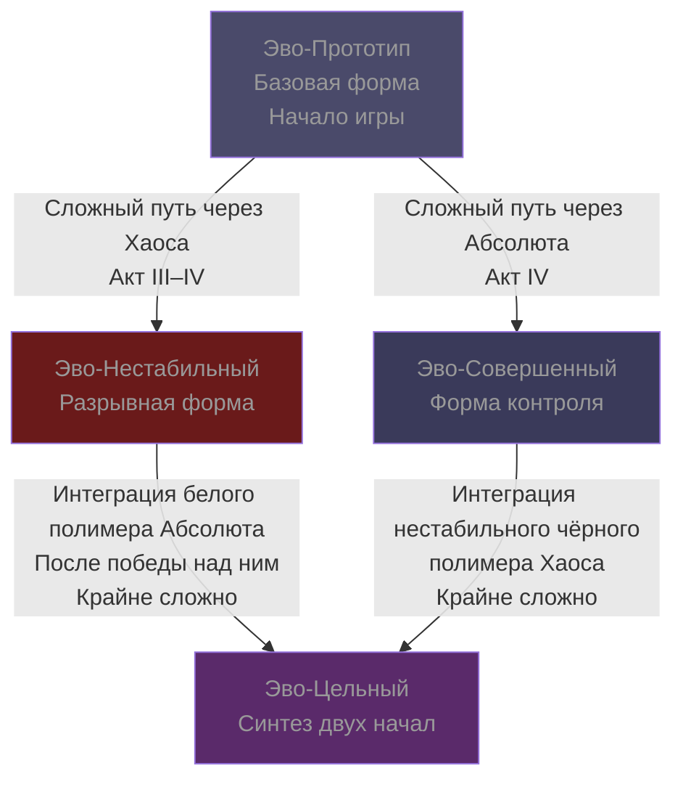

### 4.2.1. Эво-Прoтoтип (базовая форма)

Стандартные характеристики. Все моды доступны. Система Температуры неактивна. Поводок работает в полную силу.

**Отношение NPC:**
- *Цербер:* Настороженное, нейтральное.
- *Асклепий:* Как к интересному объекту исследования.
- *Атлант:* Немедленное тёплое принятие.
- *Певчие:* Любопытное, осторожное.
- *Биокульт:* Нейтральное, выжидательное.
- *Культ Хаоса:* Настороженное.

---

### 4.2.2. Эво-Нестабильный ("Разрывная форма")

**Как получить:** Длинный необязательный путь через Акт III–IV. Требует: войти в доверие Культа Хаоса, получить образцы нестабильного полимера от нескольких источников, пройти квест Асклепия "Что происходит когда полимер рвётся" (он проводит процедуру против собственной воли, потому что это важнее его моральных возражений). Можно также ускорить процесс, поглотив Хаоса - его полимер даёт необходимый материал напрямую.

**Что происходит с телом:** Чёрный полимер перестаёт быть стабилизирующим - он начинает постоянно разрываться и восстанавливаться. Это физически больно. Биомонитор **всегда красный по всем параметрам** - не потому что Эво умирает, а потому что тело в постоянном цикле микроразрушения и регенерации. Скорость и сила - побочный эффект неконтролируемой регенерации.

**Внешние изменения:** Тело мерцает как у Хаоса, но реже и менее хаотично. В моменты сильного стресса - кратковременные неконтролируемые вспышки формы.

**Бонусы формы:**

| Характеристика | Изменение |
|:--------------|:---------|
| **Скорость** | +60% во всех положениях (ходьба, бег, четвереньки, лазание) |
| **Урон** | Мультипликатор ×1.8 ко всем атакам |
| **Дистанция удара** | +80% (полимер рвётся наружу при атаке) |
| **Прыжок** | Доступен второй прыжок - на короткое время прорастают крылья из разрывающегося полимера |
| **Лазание по стенам** | Беспрепятственное. Адгезия через разрывы полимера |
| **Поводок** | Болезненнее обычного. Не нейтрализуется |

**Штрафы формы:**

| Характеристика | Изменение |
|:--------------|:---------|
| **Биомонитор** | Всегда показывает критические значения - сложнее отслеживать реальный урон |
| **Крафт и взаимодействие** | -30% скорость (руки дрожат) |
| **Выносливость** | Расход +40% (регенерация пожирает ресурсы) |
| **Диалоги** | Ряд реплик недоступен - слишком сложно концентрироваться на словах |

**Система Температуры:** При Нестабильной форме Температура работает иначе. Вместо "холода" - **"Порог"**: при длительном пребывании в форме без выхода Эво начинает терять связность речи и логику диалогов. Это не необратимо - выход из стрессовых ситуаций восстанавливает.

**Отношение NPC к Нестабильной форме:**

| Персонаж | Реакция | Цитата |
|:---------|:--------|:-------|
| **Цербер** | Уважение. Боль он понимает. | *"Ты выбрал это. Я не выбирал. Это... по-другому"* |
| **Асклепий** | Тревога + научный интерес | *"Ты разрушаешься быстрее чем восстанавливаешься. Данные... интересные. Ты не умрёшь. Наверное"* |
| **Атлант** | Боится причинить лишнюю боль | Держится осторожнее. Говорит тише. Иногда спрашивает: *"Тебе сейчас больно?"* |
| **Певчие** | Поют тише рядом. Инстинктивно | Их пение меняется - становится более низким, успокаивающим |
| **Биокульт** | Восторг. Видят "принятие несовершенства" | *"Ты принял боль мира. Ты ближе к истине чем любой из нас"* |
| **Культ Хаоса** | Принятие как своего | *"Теперь ты понимаешь. Теперь ты один из нас"* |
| **Грузчие** | Дистанцируются. Инстинкт | Держатся дальше, работают тише |
| **Собиратели** | Торгуют, но с явным дискомфортом | Короче обычного. Нервничают |

---

### 4.2.3. Эво-Совершенный ("Форма контроля")

**Как получить:** Найти белый полимер (квест Асклепия, финал Акта III), синтезировать в Акте IV. Менее труден, чем Нестабильная форма - это "основной" путь трансформации.

**Что происходит с телом:** Перезапись генетической архитектуры. Полимер стабилизируется. Поводок прекращает работу. Система Температуры активируется.

**Внешние изменения:** Шерсть становится чуть светлее. Движения точнее. Глаза светятся слабее. Голос становится ровнее.

**Бонусы формы:**

| Характеристика | Изменение |
|:--------------|:---------|
| **Точность атак** | +40% |
| **Защита** | +30% ко всем типам |
| **Цепи модов** | +1 дополнительный слот в каждой цепи |
| **Поводок** | Нейтрализован |
| **Анализ врагов** | Биомонитор показывает уязвимости противников |

**Система Температуры** (уникальная для этой формы):

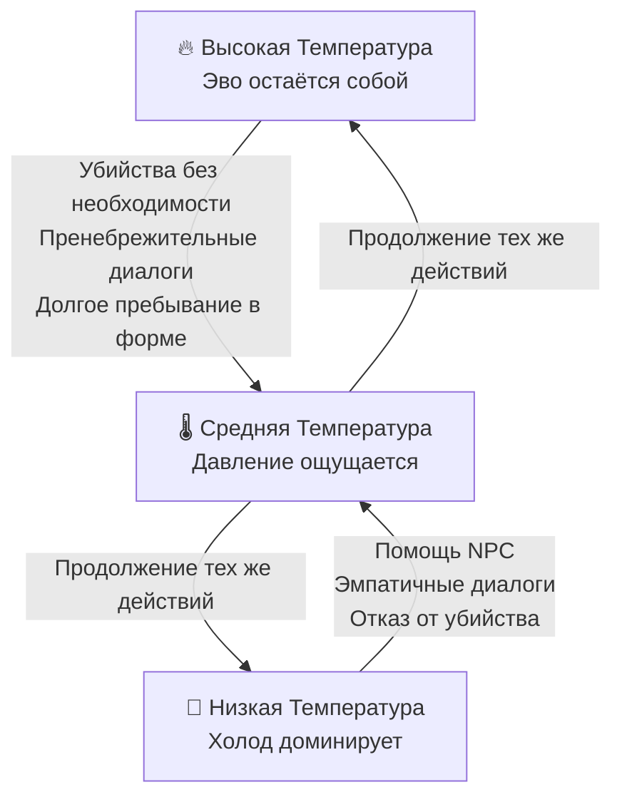

**Отношение NPC к Совершенной форме:**

| Персонаж | Реакция | Цитата |
|:---------|:--------|:-------|
| **Цербер** | Лёгкое пренебрежение | *"Стал чище. Потерял что-то настоящее"* |
| **Асклепий** | Холодное одобрение (высокая Темп.) / Тревога (низкая) | *"Ты становишься похожим на Абсолюта. Хочешь знать как остановить это? Или тебе уже всё равно?"* |
| **Атлант** | Чувствует дистанцию. Грустит | При низкой Температуре отступает на шаг. Не понимает почему. Просто чувствует |
| **Певчие** | При низкой Темп. - улетают при приближении | |
| **Биокульт** | Боятся | *"Ты несёшь в себе смерть плесени. Держись подальше от Сада"* |
| **Культ Хаоса** | Считают предателем | *"Ты выбрал тюрьму и назвал её совершенством"* |
| **Потомки Общины** | При низкой Темп. - прячутся | |

---

### 4.2.4. Эво-Цельный ("Синтез")

**Как получить:** Крайне сложный путь. Требует сначала получить одну из двух форм (Нестабильную или Совершенную), затем интегрировать противоположный полимер. Путь через Нестабильную -> интеграция белого полимера Абсолюта после его поражения. Путь через Совершенную -> интеграция нестабильного чёрного полимера Хаоса.

Асклепий предупреждает: *"Это невозможно по определению. Два полимера разрушают друг друга. Я не знаю что произойдёт. Никто не знает".*

Синтез занимает несколько минут реального времени. Эво полностью уязвим. Биомонитор показывает критические значения. Потом - стабилизация. Тишина.

**Что происходит с телом:** Оба полимера интегрируются, не уничтожая друг друга. Тело перестаёт болеть (если была Нестабильная форма). Поводок исчезает полностью - без паузы, без монолога. Эво просто идёт дальше. Первый раз, когда тело не сопротивляется ничему.

**Внешние изменения:** Шерсть приобретает двойной оттенок - тёмный с серебристыми переливами. Глаза светятся ровно, без мерцания. Движения - точные как у Совершенного, но с инстинктивной скоростью Нестабильного.

**Бонусы формы:**

| Характеристика | Изменение |
|:--------------|:---------|
| **Скорость** | +30% (меньше чем у Нестабильного, но без штрафов) |
| **Урон** | ×1.4 мультипликатор |
| **Дистанция удара** | +40% |
| **Второй прыжок** | Доступен, но стабильный - крылья прорастают контролируемо |
| **Лазание по стенам** | Беспрепятственное |
| **Защита** | +20% |
| **Цепи модов** | +1 слот |
| **Поводок** | Полностью нейтрализован |
| **Биомонитор** | Все параметры читаются нормально |

**Система Температуры:** Неактивна. Синтез двух полюсов создаёт внутреннее равновесие - Эво не давит ни холод Совершенства, ни боль Нестабильности. Он просто - есть.

**Отношение NPC к Цельной форме:**

| Персонаж        | Реакция                                                          | Цитата                                                                          |
| :-------------- | :--------------------------------------------------------------- | :------------------------------------------------------------------------------ |
| **Цербер**      | Молчит. Впервые                                                  | *"Не знаю, что ты. Это... редкость"*                                            |
| **Асклепий**    | Что-то похожее на восхищение, которое он отказывается признавать | *"Данные... я не могу объяснить данные. Это должно быть невозможным"*           |
| **Атлант**      | Просто обнимает. Без слов                                        |                                                                                 |
| **Певчие**      | Поют новую песню - никто раньше не слышал такую                  | Впервые за 120 лет - инстинкт подчинения из старой программы                    |
| **Биокульт**    | Как к богу. Буквально                                            | *"Ты несёшь в себе и жизнь и смерть плесени. Ты - выбор"*                       |
| **Культ Хаоса** | Растеряны. Их философия не предусматривает такого                | Лидер долго смотрит. Потом: *"Я не знаю, что ты доказал. Но ты что-то доказал"* |
| **Грузчие**     | Низко кланяются                                                  | Впервые за 120 лет - инстинкт подчинения из старой программы                    |
| **Собиратели**  | Лучшие цены. Без обсуждения                                      | Впервые за 120 лет - инстинкт подчинения из старой программы                    |

---

## 4.3. Цербер (Хищный прототип)

| Параметр | Значение |
|:---------|:---------|
| **Имя** | "Цербер" - кодовое. Своего не взял: *"Зачем? Некому было называть"* |
| **ДНК** | Человек 30% + Гепард 30% + Змея 20% + Гиена 20% |
| **Рост / Вес** | 170 см / 65 кг |
| **Внешность** | Пятнистая шерсть, ядовитые клыки, присоски на лапах, зрачок как у кошки |
| **Поколение** | Из капсулы. Помнит лаборатории и учёных |
| **Где живёт** | Рубеж и промышленные кварталы Литейной |
| **Поводок** | Активен. Знает его с точностью до метра |

**Что делал 120 лет:** Охотился. Выжил. Однажды встретил другого Цербера из капсулы - они прожили вместе несколько лет. Тот погиб на третьем году совместной охоты. Неудачный прыжок, неправильная оценка высоты. Цербер не говорит об этом сам. Если Эво спрашивает напрямую: *"Это было давно. Неважно"*. По его поведению - очень важно.

**Чего боится:** Снова привязаться к кому-то и снова потерять. Одиночество - не характер. Это защита.

**Чего хочет:** Не быть одним. Не умеет говорить об этом. Возможно, не осознаёт полностью.

**Отношение к Эво в разных формах:** (см. таблицы форм)

**Ключевой диалог при высоких отношениях:** *"Ты странный. Большинство из нас либо убивают, либо прячутся. Ты... разговариваешь. Я не понимаю зачем. Но я... не против".*

---

## 4.4. Асклепий (Умный прототип)

| Параметр | Значение |
|:---------|:---------|
| **Имя** | Выбрал сам из медицинской базы данных. Педантично и осознанно |
| **ДНК** | Человек 40% + Барс 20% + Осьминог 20% + Белый полимер 20% |
| **Рост / Вес** | 140 см / 45 кг |
| **Внешность** | 4 щупальца на спине, жабры, белая шерсть |
| **Поколение** | Из капсулы. Наблюдал учёных дольше всех до заморозки |
| **Где живёт** | Госпиталь ("Белый дом"). Выбор осознанный - запах дезинфектора, похожий на лабораторию |
| **Поводок** | Активен. Принял как данность 40 лет назад |

**Что делал 120 лет:** Изучал всё. Написал несколько томов наблюдений на стенах - бумаги нет. Вылечил несколько существ, забредших к нему. Не из доброты - из интереса. Потом заметил, что ждёт их возвращения. Не стал анализировать почему.

**Чего боится:** Умереть, не поняв зачем был создан.

**Чего хочет:** Разговаривать с кем-то равным. 120 лет - много даже для рационального ума.

**Ключевая сцена:** *"Я помню одну учёную. Она плакала, закрывая мою капсулу. Я так и не понял - это было плохо или хорошо. Я думал об этом 120 лет. У меня нет ответа".*

**Роль в системе форм:** Единственный, кто знает о возможности трансформации. Рассказывает только Эво. Помогает с процедурами против своей воли - потому что это важнее возражений. После получения Цельной формы: *"Данные... я не могу объяснить данные"*. Первый раз за 120 лет - пауза перед словами.

---

## 4.5. Атлант (Сильный прототип)

| Параметр | Значение |
|:---------|:---------|
| **Имя** | Называет себя "Большой". "Атлант" - кодовое, откликается |
| **ДНК** | Человек 30% + Медведь 35% + Собака 20% + Горилла 15% |
| **Рост / Вес** | 220 см / 180 кг |
| **Внешность** | Огромная мышечная масса, густая шерсть, непробиваемая шкура |
| **Поколение** | Из капсулы. Помнит мало - заморозили быстро |
| **Где живёт** | Яма. Никогда не уходил далеко |
| **Поводок** | Активен. Никогда не пытался уйти |

**Что делал 120 лет:** Жил в Яме. Чинил что мог. Однажды нашёл потомков Общины в туннелях - приносил еду. Они боялись его. Однажны он не встретил никого там, где были все. Ждал, что придут сами, когда перестанут бояться. Не дождался. Узнал позже, от Певчих, что последний умер в 2290-м.

**Чего боится:** Причинить вред тому, кого любит, - он слишком большой, слишком сильный.

**Чего хочет:** Семью. Конкретно - кого-то, о ком заботиться, и кто не боится.

**Ключевой момент:** При Нестабильной форме Эво - Атлант говорит тише и двигается осторожнее рядом. При Цельной - просто обнимает. Без слов. Это его самое сложное высказывание.

---

## 4.6. Хаос (Нестабильный прототип)

| Параметр | Значение |
|:---------|:---------|
| **Имя** | "Хаос" - кодовое. Своего не взял: *"Зачем имя тому, кто не знает, какой он сейчас"* |
| **ДНК** | Человек 35% + Пума 25% + Змея 20% + Чёрный полимер 20% |
| **Рост / Вес** | 160 см / 55 кг (постоянно меняется) |
| **Внешность** | Тело мерцает, непрерывно меняет форму - не контролируется |
| **Поколение** | Из капсулы. Помнит - и это хуже чем не помнить |
| **Где живёт** | Глубокие подземелья. Поводок и его нестабильность загнали его туда |
| **Поводок** | Активен. Болезненнее чем у других - нестабильность усиливает реакцию |

### История Хаоса и Абсолюта - конфликт близнецов

Хаос и Абсолют созданы почти одновременно в 2199 году. Они были вместе в лаборатории. Единственные, кто помнит друг друга оттуда.

Учёные рассматривали их как два полюса одного вопроса: что лучше - стабильность или адаптивность? Они тестировали обоих параллельно. В самом начале - до того как полимеры окончательно закрепились - они были почти равны.

Потом тесты начали расходиться. Абсолют показывал стабильные результаты. Хаос - яркие вспышки и обрушения. Учёные смотрели на Абсолюта с гордостью. На Хаоса - с сожалением.

Хаос это видел. Каждый день. На протяжении нескольких месяцев до заморозки.

Он пробовал стать стабильнее. Каждую ночь. Контролировать форму, замедлить мерцание, зафиксировать что-то одно. Не получалось. Потом пробовал принять белый полимер - тот, что делал Абсолюта стабильным. Это убивало его. Каждый раз.

Абсолют знал об этих попытках. Видел шрамы. Никогда не говорил о них вслух - из уважения или из жалости, сам Хаос не знал. Именно это непонимание и превратилось в ярость: жалость Абсолюта была невыносима.

За 120 лет они не нашли мира. Но и не уничтожили друг друга - физически не могут. Их полимеры при прямом контакте нейтрализуют друг друга, и оба теряют сознание. Поэтому конфликт существует как вечное равновесие.

**Что делал 120 лет:** Страдал. Нестабильность - физическая боль, постоянная. Пробовал контролировать. Перестал. *"Легче не пытаться. Меньше разочарований"*. Сформировал Культ Хаоса - не намеренно. Просто его нестабильность привлекала других нестабильных. Сначала он не понимал что происходит. Потом принял.

**Чего боится:** Что боль никогда не прекратится.

**Чего хочет:** Покоя. Любого.

**Ключевая сцена перед боем:** *"734. Тебя заморозили. Меня - оставили работать. Я видел каждый день. Видел как они смотрели на Абсолюта - с гордостью. На меня - с сожалением. Ты знаешь что хуже - быть ненужным или быть слишком опасным? Нет, не знаешь. Ты спал".*

**После поражения:** *"Ты лучше. Хорошо. Это правильно. Возьми. Мне больше не нужно"*. Тихо. Без горечи - что странно. Как будто он ждал именно этого.

---

## 4.7. Абсолют (Стабильный прототип)

| Параметр | Значение |
|:---------|:---------|
| **Имя** | "Абсолют" - кодовое. Принял как точное описание: *"Я - абсолют. Что тут менять"* |
| **ДНК** | Человек 40% + Собака 25% + Гепард 20% + Белый полимер 15% |
| **Рост / Вес** | 165 см / 60 кг |
| **Внешность** | Белая шерсть с серебристым отливом, 3 светящихся глаза, абсолютно симметричная форма |
| **Поколение** | Из капсулы. Помнит всё до заморозки |
| **Поводок** | За 120 лет нейтрализовал частично - может уходить дальше других, но не покинуть Котловину |

**Что делал 120 лет:** Совершенствовался по плану. Каждый год - новый навык, новое умение. Наблюдал за конфликтами извне, не вмешиваясь. Смотрел как умирали люди в туннелях - не помог и не навредил. Пришёл к выводу, что вмешательство нарушило бы естественный процесс. Это заключение его устроило. Он так и не проверил, устраивает ли оно его на самом деле.

**Чего боится:** Что его концепция мира неверна. Поэтому так яростно её защищает.

**Чего хочет:** Доказать - себе в первую очередь - что нестабильность это слабость. Потому что если это не так, то 120 лет одиночества были напрасны. Он не может этого допустить.

**Отношение к Хаосу:** Не ненависть. Жалость. Что для Хаоса хуже любой ненависти. Абсолют это знает и тем не менее не может остановиться. Жалость - честная реакция. Он не умеет притворяться.

**Отношение к Эво:** До встречи - теоретический интерес. После - угроза, которую нужно устранить. Не из страха. Из принципа: Эво доказывает что-то, что Абсолют не хочет принять как доказанное.

**Диалог перед боем:** *"Образец 734. 120 лет. Ты наконец проснулся. Я ждал. Не из нетерпения - из интереса. Хотел увидеть что из тебя вышло. Ответ... неожиданный. Ты не стал совершенным. Ты стал чем-то другим. Это должно умереть. Не из злобы. Из принципа".*

**Финальная сцена:** *"Я был неправ. Не о тебе. О себе. Я думал что совершенство - отсутствие ошибок. Но ты делал ошибки. И всё равно здесь. Нестабильность - не слабость. Это другая стратегия. Я... не рассматривал такую возможность. Сто двадцать лет. Не рассматривал".*

Долгая пауза. *"Возьми мою силу. Пусть кто-то с ней что-то сделает".*

**Особый диалог если Эво - Нестабильный:** *"Ты выбрал боль. Добровольно. Я не понимаю этого. Я пытался понять 120 лет - когда наблюдал Хаоса. Не понял. И сейчас не понимаю. Это... раздражает".*

**Особый диалог если Эво - Цельный:** Долгое молчание перед боем. Потом: *"Ты сделал то, что Хаос пытался сделать всю жизнь. Интересно. Я не знаю что это значит для моей теории. Нужно это обдумать"*. Пауза. *"Жаль, что после боя у меня может не быть времени".*

---

# 5. Культы и фракции

## 5.1. Карта фракций

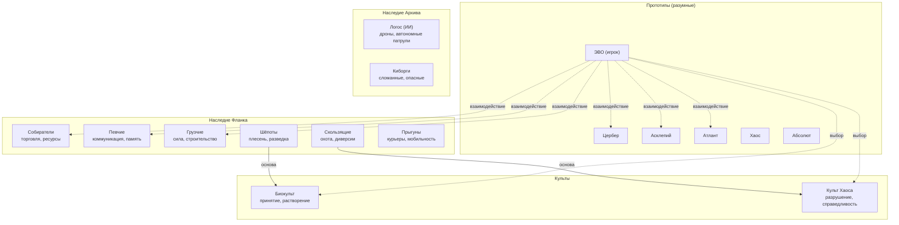

---

## 5.2. Биокульт

### Происхождение

2215–2220 годы. Часть экспериментов Фланка не ушла с поверхности. Заражались Микоризой-7 и... не умирали. Мицелиальная сеть Улья передаёт химические сигналы - это создаёт ощущение связанности. Не мистика - биология. Первые "выжившие с плесенью" стали доказательством: можно принять.

**Теология:** Микориза-7 - иммунный ответ луны. Принять плесень - признать вину предков и стать частью вечного. Смерть - растворение в грибнице. Улей помнит всех вошедших.

**Главная ложь культа (члены не знают):** Улей не помнит. Растворившиеся - просто питательный субстрат. Если Эво это обнаружит и расскажет - культ может разрушиться или превратиться во что-то ещё более опасное из отчаяния.

**Где искажение:** "Принять плесень" превратилось в "ускорить принятие у других". Миссионерство стало принуждением - из искренней заботы, доведённой до абсурда.

**Внутренние противоречия:**

| Поколение | Характер | Отношение к доктрине |
|:---------|:---------|:--------------------|
| **Основатели** | Личный опыт | Иногда сомневаются |
| **Рождённые в культе** | Только догма | Не сомневаются никогда |

---

## 5.3. Культ Хаоса

### Происхождение

Основан потомками экспериментов, оказавшихся между двух огней войны. Первый вопрос: **почему умирали мы, а не они?**

Первоначальная идеология - анархизм: никакая система не имеет права распоряжаться жизнями других. Хаос - честность. Мир без иерархий.

**Где пошли не туда:** Когда культ начал рекрутировать нестабильные эксперименты - их инстинкты вытеснили философию. "Никакой системы" превратилось в "разрушение как самоцель". Жертвоприношения - сначала уничтожали символы старого мира, потом символы кончились.

**Лидер:** Старый эксперимент, помнящий войну. Знает оригинальную идею и страдает от того, во что она превратилась. Продолжает - это единственное что у него есть. **Трагедия, не злодей.**

**Молодые члены:** Не знают оригинальной философии. Для них это единственная семья. Если Эво предложит что-то взамен - часть уйдёт.

---

## 5.4. Серийные эксперименты Фланка

| Вид | Основа ДНК | Роль | Поколение | Отношение к Эво |
|:----|:----------|:-----|:---------|:----------------|
| **Собиратели** | Человек + Насекомое | Ресурсы, торговля | Смешанное | Нейтральное |
| **Певчие** | Человек + Птица | Коммуникация, память | В основном рождённые | Дружелюбное |
| **Грузчие** | Человек + Медведь | Строительство, охрана | Рождённые | Нейтральное |
| **Шёпоты** | Человек + Плесень | Разведка, Биокульт | Рождённые | Загадочное |
| **Скользящие** | Человек + Рептилия | Охота, Культ Хаоса | Рождённые | Враждебное |
| **Прыгуны** | Человек + Лягушка | Курьеры | Рождённые | Нейтральное |

---

# 6. Бестиарий

## 6.1. Естественная фауна Триоса

| Название | Тип | Опасность | Социальность | Поведение |
|:---------|:----|:---------|:-------------|:---------|
| **Бомбардир** | Инсектоид | 5/10 | Одиночка | Стреляет кислотой при приближении |
| **Роевая муха** | Инсектоид | 6/10 | Рой 50–100 | Реагирует на звук |
| **Термит-копатель** | Инсектоид | 3/10 | Семья | Нейтрален если не тревожить |
| **Паук-лифтёр** | Инсектоид | 6/10 | Одиночка | Засадный, плетёт сети |
| **Королева улья** | Инсектоид | 9/10 | Улей | Неподвижна, управляет роем |
| **Каменнозуб** | Млекопитающее | 6/10 | Пара | Нейтрален, опасен если загнан |
| **Пещерный бегун** | Млекопитающее | 5/10 | Стая | Охотится стаей |
| **Пустынный скорпион** | Ящер | 7/10 | Одиночка | Активен только ночью |
| **Гривистый волк** | Млекопитающее | 6/10 | Стая | Имитирует звуки и голоса |
| **Шипастый геккон** | Ящер | 4/10 | Одиночка | Маскируется под стены |
| **Термальный варан** | Ящер | 6/10 | Одиночка | У геотермальных трещин, нейтрален |
| **Летающий змей** | Ящер | 6/10 | Пара | Охотится на Певчих |
| **Древний ящер** | Ящер | 9/10 | Одиночка | Всё вокруг прячется при появлении |

---

## 6.2. Киборги Архива

| Название | Описание | Опасность |
|:---------|:---------|:---------|
| **Патрульный** | Стандартный с винтовкой | 5/10 |
| **Тяжёлый** | Броня, пулемёт, медленный | 8/10 |
| **Снайпер** | Неподвижен, замаскирован | 7/10 |
| **Безумный** | Импланты сломаны, атакует всех | 4/10 |

---

## 6.3. Дроны Логоса

| Название | Описание | Опасность | Поведение |
|:---------|:---------|:---------|:---------|
| **Пчела** | Маленький разведчик | 2/10 | Сигнализирует другим |
| **Шершень** | Боевой с лазером | 5/10 | Атакует обнаруженное |
| **Страж** | Тяжёлый, ракеты | 8/10 | Медленный, смертельный |
| **Рой** | 20–50 дронов | 9/10 | Непереживаем в открытом бою |

Все дроны уходят под землю во время радиоактивного шторма - единственное предсказуемое окно безопасности.

---

## 6.4. Плесневые формы (Микориза-7)

| Название | Штамм | Опасность | Влияние на мир |
|:---------|:------|:---------|:--------------|
| **Споровик** | Серый | 3/10 | Взрывается при приближении, распространяет споры |
| **Ползун** | Серый | 2/10 | Движется к источникам тепла, постепенно заражает |
| **Ходок** | Алый | 5/10 | Гуманоидная форма, активный охотник |
| **Улей** | Чёрный | 7/10 | Разумный организм, центр распространения |

---

# 7. Механики

## 7.1. Система "Полимерная логика"

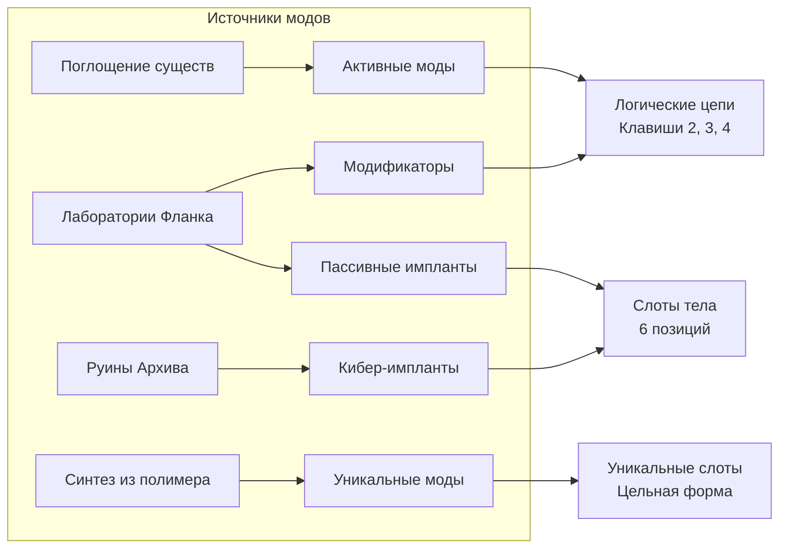

---

### 7.1.1. Активные моды

| № | Название | Эффект | Урон | Выносливость | Кулдаун | Источник |
|---|:---------|:-------|:-----|:------------|:--------|:---------|
| 1 | **Плеть** | Полимерный серп, атака по дуге | 25 | 10% | 1 с | Начальная лаборатория |
| 2 | **Взрывная гранула** | Сфера, взрыв при контакте | 60 (10 себе) | 20% | 3 с | Лаборатория Фланка |
| 3 | **Шипы** | Шипы из тела (AoE) | 15×4 | 15% | 2 с | Поглотить Бомбардира |
| 4 | **Рывок** | Мгновенный рывок, проход сквозь врагов | 30 | 25% | 4 с | Лаборатория Фланка |
| 5 | **Крик** | Оглушение в радиусе | 10 | 30% | 8 с | Певчие (научить) |
| 6 | **Регенерация** | Мгновенное восстановление HP | +40 HP | 40% | 12 с | Торговля у Асклепия |
| 7 | **Маскировка** | Полупрозрачность, 5 сек | - | 20%+5%/с | 15 с | Лаборатория Фланка |
| 8 | **Ледяной шип** | Точный снаряд | 45 | 15% | 2 с | Поглотить Древнего ящера |
| 9 | **Кислотный плевок** | Урон + DoT×5 сек | 15+10×5 | 15% | 3 с | Поглотить Бомбардира |
| 10 | **Телепорт** | Мгновенно 15 м | - | 30% | 8 с | Секретная лаборатория |

---

### 7.1.2. Модификаторы

| № | Название | Эффект |
|---|:---------|:-------|
| 1 | **Триггер попадания** | При попадании - следующий мод в цепи |
| 2 | **Триггер таймера** | Через 0.5–2 сек - следующий мод |
| 3 | **Двойное заклинание** | Следующий мод × 2 |
| 4 | **Усиление** | +50% урона следующего мода |
| 5 | **Отложенный взрыв** | Взрыв через 1 сек вместо мгновенного |
| 6 | **Самонаведение** | Снаряд слегка наводится на врага |
| 7 | **Щадящий** | Не наносит урон игроку |
| 8 | **Пробивание** | Снаряд проходит сквозь врагов |
| 9 | **Рассеивание** | 1 снаряд -> 3 (33% урона каждый) |
| 10 | **Отражение** | Отражается от стен до 2 раз |

---

### 7.1.3. Пассивные импланты

| № | Название | Слот | Эффект |
|---|:---------|:-----|:-------|
| 1 | **Роторный насос** | Сердце | +30% выносливость, +20% регенерация, +25% кровопотеря |
| 2 | **Полимерный мозг** | Мозг | Устойчивость к травмам, +20% урон активных модов |
| 3 | **Гидравлические лапы** | Ноги | +100% высота прыжка, +50% скорость бега |
| 4 | **Терморегулятор** | Спина | Защита от огня и холода, +50% устойчивость к плесени |
| 5 | **Оптический имплант** | Глаза | Ночное зрение, тепловизор (10 м сквозь стены) |
| 6 | **Усилитель хвата** | Руки | +30% урон ближнего боя, подъём тяжёлых объектов |
| 7 | **Полимерная регенерация** | Кровь | +50% регенерация HP, +50% расход выносливости |
| 8 | **Адреналиновая железа** | Эндокринная | При HP<20%: +50% скорость и урон |
| 9 | **Хитиновая броня** | Кожа | +30% физическая защита, -10% скорость |
| 10 | **Термальная защита** | Кожа | +100% защита от огня |

---

## 7.2. Система "Температура" (Совершенная форма)

Белый полимер давит на эмоциональную архитектуру. Эво становится холоднее. Это **давление, а не приговор**.

**Что повышает Холод (снижает Температуру):**
- Убийства разумных существ без необходимости
- Пренебрежительные диалоговые опции
- Длительное пребывание в Совершенной форме без "якорных" действий

**Что удерживает Температуру:**
- Помощь NPC, выполнение их квестов
- Эмпатичные диалоговые опции
- Отказ от убийства при наличии альтернативы

**Температура - не мораль.** Можно пройти всю игру с низкой Температурой и получить хорошую концовку. Она прозвучит иначе.

---

## 7.3. Медицинская система

| Параметр | 0–20% | 20–40% | 40–60% | 60–80% | 80–100% |
|:---------|:------|:-------|:-------|:-------|:--------|
| **Кровопотеря** | Норма | Слабость -20% скорости | Головокружение | Обморок 5–10 сек | Смерть |
| **Конечности** | Норма | Нога: -30% скорость | Рука: -30% урон | Хвост: потеря атаки | Отрыв |
| **Инфекция** | Норма | Лёгкая лихорадка | Тяжёлая, галлюцинации | Сепсис | Смерть |
| **Плесень** | Норма | Кашель | Галлюцинации (ложные враги) | Потеря контроля | Превращение |
| **Энтропия** | Норма | Лёгкие мутации | Снижение характеристик | Потеря модов | Смерть |

**Лечение:**
- Кровопотеря -> перевязка, инъекции
- Конечности -> шина, регенерация (мод)
- Инфекция -> антибиотики, алкоголь
- Плесень -> противогрибковые, огонь
- Энтропия -> поглощение существ

**Особенность Нестабильной формы:** Биомонитор всегда показывает критические значения по всем параметрам. Реальный урон приходится отслеживать косвенно - по анимации, звуку, скорости движения.

---

## 7.4. Система "Генетическая память"

При поглощении существа Эво получает **флэшбек от первого лица** - 3–5 секунд от взгляда поглощённого. Нарративный элемент и игровая механика одновременно.

**Что можно увидеть:** Маршруты и тайные проходы. Угрозы, которых боялось существо. Фрагменты памяти, рассказывающие историю мира.

**Особые поглощения:**
- *Певчий* -> навигационная песня-флэшбек, фрагмент карты
- *Шёпот* -> изнутри грибницы, "голоса" Улья
- *Старый Грузчий* -> фрагмент памяти о живых людях
- *Хаос* -> вспышка боли и мерцания, потом - неожиданная тишина
- *Абсолют* -> 5 секунд абсолютной ясности и контроля. Эво видит мир как Абсолют - каждая деталь чёткая, каждое движение просчитанное. Потом возвращается к себе. Это странно - и лучше, и хуже одновременно.

---

## 7.5. Живая плесень - зональная система

Мир делится на **секторы** с параметром заражённости (0–100%), обновляемым редко.

**Правила распространения:**
- Улей в секторе -> +2%/мин
- Улей уничтожен -> рост останавливается, -0.5%/мин (медленное отступление)
- Соседний сектор >60% -> заражение распространяется
- Огонь / кислота -> локальное снижение
- Радиоактивный шторм -> биолюминесценция усиливается, рост не ускоряется

| Уровень | Визуал | Геймплей |
|:--------|:-------|:---------|
| **0–20%** | Одиночные Споровики | Минимальная угроза |
| **20–50%** | Ползуны активны, воздух мутный | Видимость снижена |
| **50–80%** | Ходоки патрулируют | Нужна защита |
| **80–100%** | Почти непроходимо | Улей может породить новый Улей |

---

## 7.6. Прогрессия игрока

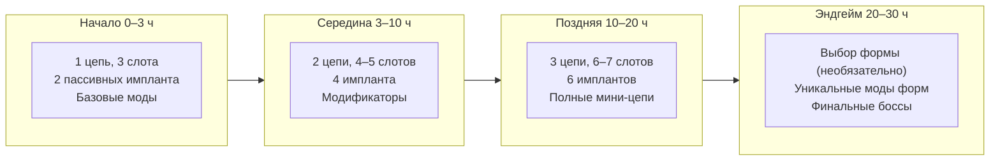

**Формы в прогрессии:**
- Нестабильная - доступна с Акта III, требует значительных вложений
- Совершенная - доступна в Акте IV, основной путь трансформации
- Цельная - доступна в локации обитения Абсолюта при наличии одной из форм

---

## 7.7. Активный рэгдолл (PuppetMaster)

| Механика | Описание | Влияние на геймплей |
|:---------|:---------|:--------------------|
| **Динамическая балансировка** | Персонаж балансирует при движении. Резкий поворот - скольжение | Нельзя мгновенно развернуться на полном бегу |
| **Зацепление когтями** | При падении - зацепиться за выступ (A/D + Space) | Спасает от смерти с высоты |
| **Расслабление (X)** | Полный рэгдолл. Проход в щели, притворство мёртвым | Враг теряет агро |
| **Физика ударов** | При попадании - отлёт с анимацией | Удары имеют вес |
| **Инерция бросков** | Сила броска зависит от скорости движения | Разбег усиливает бросок |

---

# 8. Управление

## 8.1. Движение

| № | Действие | Клавиша | Тип | Механика |
|---|:---------|:--------|:----|:---------|
| 1 | Ходьба | `WASD` | постоянно | 100% скорость |
| 2 | Бег | `L-Shift` | удержание | 150%, расход выносливости |
| 3 | Приседание | `S` | удержание | -40% высота, 70% скорость |
| 4 | Четвереньки | `L-Ctrl` | удержание | 200%, нельзя использовать руки |
| 5 | Прыжок (короткий) | `Space` | нажатие <0.2 с | Фиксированная сила |
| 6 | Прыжок (длинный) | `Space` | удержание >0.2 с | 100–250% от времени удержания |
| 7 | Второй прыжок | `Space` (в воздухе) | нажатие | Только Нестабильная / Цельная форма |
| 8 | Лазанье по стенам | `A/D` у стены | удержание | Прилипание. Беспрепятственно в Нестабильной / Цельной |
| 9 | Прыжок от стены | `Space` у стены | нажатие/удержание | Сила зависит от удержания |
| 10 | Лазанье по лестницам | `W/S` у объекта | удержание | Вертикальный режим |

## 8.2. Бой и взаимодействие

| № | Действие | Клавиша | Тип | Механика |
|---|:---------|:--------|:----|:---------|
| 11 | Атака | `ЛКМ` | нажатие | Текущий предмет / когти |
| 12 | Укус | `ПКМ` (пустые руки) | нажатие | Высокий урон, пробивает броню |
| 13 | Взаимодействие | `E` | нажатие <0.3 с | Двери, терминалы, NPC |
| 14 | Поднять предмет | `E` | удержание >0.3 с | Прогресс-бар |
| 15 | Бросок | `Средняя КМ` | отпускание | Сила = расстояние до курсора |
| 16 | Взять в зубы | `F` | нажатие | Зубной слот, можно бежать |
| 17 | Сменить руки | `Q` | нажатие | Левая ↔ правая |
| 18 | Активная рука | `R` | нажатие | Выбор основной руки |
| 19 | Хвост | `Q` (в бою) | нажатие | Низкий урон, оглушение, AoE |

## 8.3. Системы

| № | Действие | Клавиша | Тип | Механика |
|---|:---------|:--------|:----|:---------|
| 20 | Обычный режим | `1` | нажатие | Только статические моды |
| 21 | Цепь 1 | `2` | нажатие | Первая логическая цепь |
| 22 | Цепь 2 | `3` | нажатие | Вторая цепь |
| 23 | Цепь 3 | `4` | нажатие | Третья цепь |
| 24 | Биомонитор | `Z` | переключение | HUD: кровопотеря, энтропия, инфекция, плесень |
| 25 | Расслабиться | `X` | удержание | Активный рэгдолл |
| 26 | Рёв | `B` | нажатие | Привлечение / пугание, мод "Призыв" |
| 27 | Инвентарь | `Tab` | переключение | 5 быстрых слотов, слоты рук, зубной слот |
| 28 | Крафт | `C` | переключение | Сетка 4×4, прогресс-бар 1–5 сек |
| 29 | Пауза | `Esc` | переключение | Полная пауза в сингле |

---

# 9. Технические требования

## 9.1. Минимальные требования

| Компонент | Требование | Примечание |
|:---------|:-----------|:-----------|
| **ОС** | Windows 10 64-bit | |
| **CPU** | Intel i5-8400 / AMD Ryzen 5 2600 | 6 ядер |
| **ОЗУ** | 8 GB | LLM и физика должны ужиться |
| **GPU** | GTX 1060 6GB / RX 580 8GB | Пиксельные шейдеры, частицы |
| **Накопитель** | SSD, 100 GB | Быстрая генерация чанков |
| **DirectX** | Version 11 | |

## 9.2. Рекомендуемые требования

| Компонент | Требование | Примечание |
|:---------|:-----------|:-----------|
| **ОС** | Windows 11 64-bit | |
| **CPU** | Intel i7-10700 / AMD Ryzen 7 3700X | 8+ ядер |
| **ОЗУ** | 16 GB | Средняя LLM в памяти постоянно |
| **GPU** | RTX 3060 / RX 6600 XT | 8–12 GB VRAM |
| **Накопитель** | NVMe M.2 SSD, 100 GB | |
| **DirectX** | Version 12 | |

## 9.3. Оптимизация

| Стратегия | Описание | Эффект |
|:---------|:---------|:-------|
| **Асинхронная загрузка LLM** | Загружается при входе в зону NPC, выгружается при выходе | -200–600 МБ ОЗУ |
| **Чанковая загрузка** | Мир загружается частями 64×64 тайла | ОЗУ физики: 1–2 ГБ |
| **LOD** | На расстоянии >10 м физика частиц отключается | Экономия CPU |
| **Атласы спрайтов** | Все текстуры одного типа в одном файле | Снижение Draw Calls |
| **Зональная плесень** | Один параметр на сектор, редкое обновление | Минимальная нагрузка |

## 9.4. Стек технологий

| Технология | Роль | Референс |
|:-----------|:-----|:---------|
| **Corgi Pixel Physics** | Физика каждого пикселя | Noita |
| **PuppetMaster + Magica Cloth 2** | Активный рэгдолл | Casualties: Unknown |
| **ProPixelizer** | 3D-модели как пиксельный арт | Rain World |
| **Aviad AI + MoonSharp** | NPC с LLM, поддержка модов | - |

---

## Заключение

**"Триос: 734"** - игра о том, что значит быть созданным для чужих целей и учиться жить своими. Эво - не герой и не монстр. Он существо, которое просыпается в мире без инструкций и строит себя с нуля.

Четыре формы - четыре ответа на один вопрос: кем ты хочешь стать, когда тебе никто не говорит, кем ты должен быть? Можно остаться собой. Можно принять боль как суть. Можно искать контроль. Можно попробовать вместить в себя всё - и посмотреть, что из этого выйдет.

Люди исчезли. Их сменили те, кого они создали. Вопрос не в том, были ли люди правы - вопрос в том, что делать с тем, что осталось.

**Главное ощущение:** Хрупкий бог, который может уничтожить всё вокруг - и умереть от заражённой раны.

---

*Версия документа: 4.1*
*Дата: 12 июня 2026 года*
*Автор: Radis*