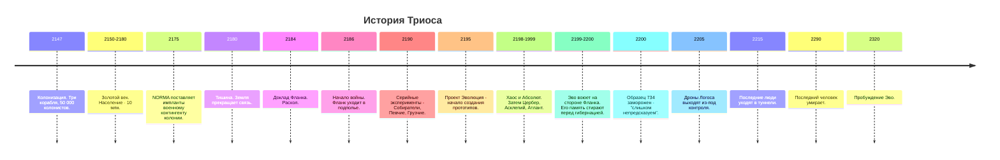
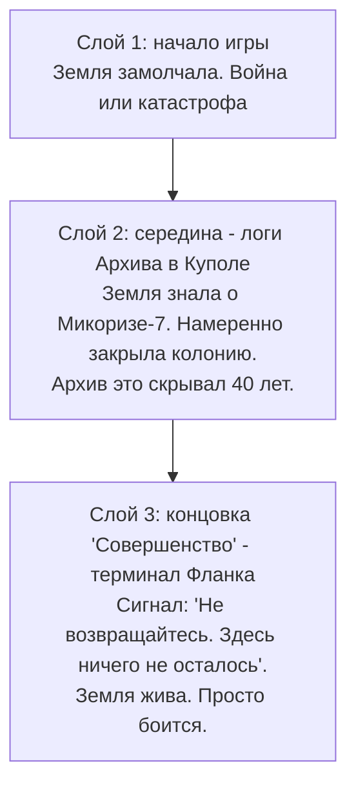
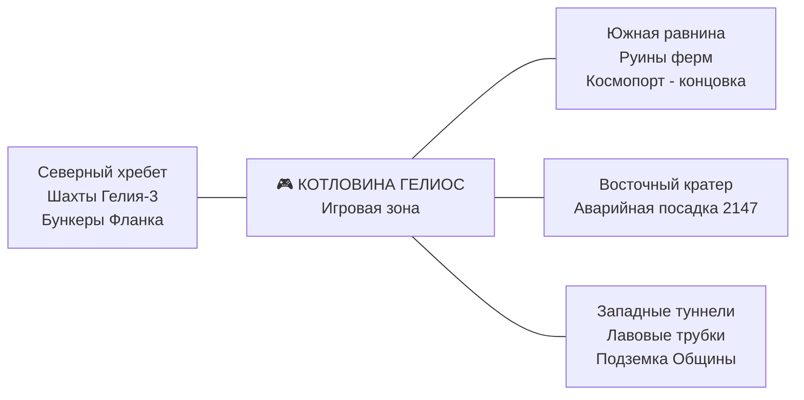
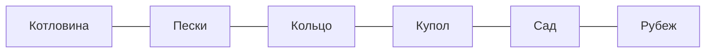
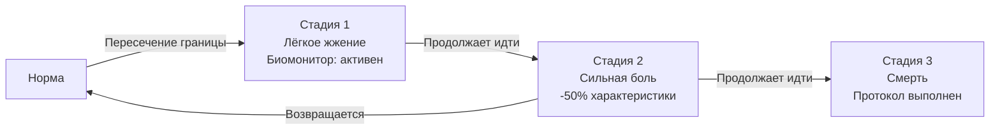
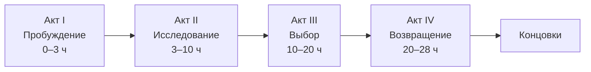
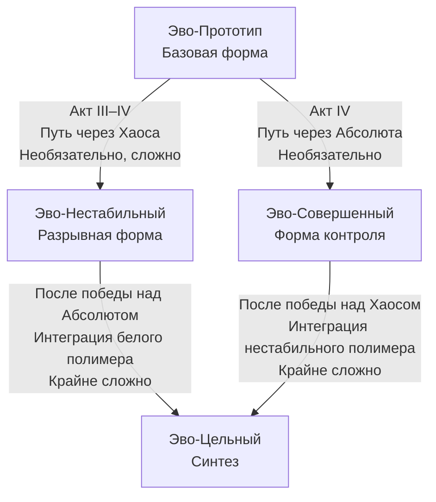
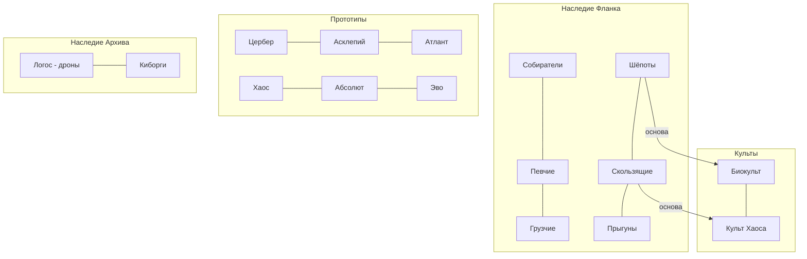
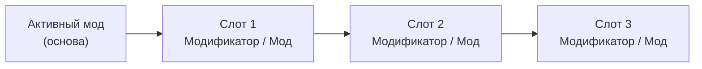

*Версия 5.0 · Автор: Radis · Дата: 16 июня 2026 года*

> **Главная идея:** Мир, где биология стала оружием, люди - пережитком, а мораль - личным выбором. Игрок - существо, рождённое чужой волей, воевавшее в чужой войне и не помнящее ни того, ни другого. Теперь у него есть шанс выбрать - впервые.

---

## Содержание

- [[#1. Вселенная Триоса]]
- [[#2. Карта мира]]
- [[#3. Полный сюжет]]
- [[#4. Персонажи]]
- [[#5. Культы и фракции]]
- [[#6. Бестиарий]]
- [[#7. Механики]]
- [[#8. Управление]]
- [[#9. Технические требования]]

---

# 1. Вселенная Триоса

## 1.1. Физика мира

Триос - луна газового гиганта Эребус. Эребус занимает треть видимого неба и виден всегда - меняет только фазы. Ночью подсвечивает поверхность холодным сине-фиолетовым светом. В период магнитных бурь его атмосфера окрашивается в грязно-оранжевый.

| Параметр           | Значение                 | Влияние на геймплей                       |
| :----------------- | :----------------------- | :---------------------------------------- |
| **Гравитация**     | 1.0g (земная)            | Стандартная физика                        |
| **Атмосфера**      | Дышимая, но тонкая       | Перепады давления при штормах             |
| **Магнитное поле** | Слабое                   | Радиация от Эребуса периодически проходит |
| **Цикл дня**       | 31 земной час            | Длинные ночи и дни                        |
| **Температура**    | -40°C ночью / +25°C днём | Влияет на фауну и плесень                 |

Колония построена в **Котловине Гелиос** - геологической впадине, защищённой хребтами с трёх сторон. Геотермальная активность давала тепло. Единственное место на Триосе, где люди выживали без скафандров.

---

## 1.2. Таймлайн (2147–2320)



### Детальная хронология

| Годы      | Событие        | Детали                                                                                                                                                                                                                                                               |
| :-------- | :------------- | :------------------------------------------------------------------------------------------------------------------------------------------------------------------------------------------------------------------------------------------------------------------- |
| 2147–2180 | Золотой век    | Три корабля, строительство, расцвет. Аварийная посадка второго корабля - кратер сохранился. NORMA поставляет военный контингент с экспериментальными имплантами.                                                                                                     |
| 2180      | Тишина         | Последний корабль с Земли. Правда: Земля получила данные о Микоризе-7 и закрыла контакт намеренно. Архив это знал и скрывал.                                                                                                                                         |
| 2184–2186 | Раскол и война | Фланк: "Без изменения биологии вымрем". Архив отвергает публично, тайно запрашивает у NORMA средства подавления. Война.                                                                                                                                              |
| 2190–1999 | Эксперименты   | Серийные виды, затем прототипы. Хаос и Абсолют - первые, почти одновременно.                                                                                                                                                                                         |
| 2199–2200 | Война Эво      | Образец 734 участвует в боевых операциях Фланка. Хаос и Абсолют воюют рядом. Эво - эффективен, непредсказуем, опасен. Перед гибернацией полимерный код перезаписывается: память, импланты, модификаторы - всё стёрто. Причина в журналах: *"Слишком непредсказуем"*. |
| 2205–2215 | Агония         | Дроны сходят с ума. Люди уходят в туннели. Учёные Фланка запечатывают лаборатории.                                                                                                                                                                                   |
| 2220–2290 | Вымирание      | Последние люди умирают в туннелях. Последний - в 2290-м.                                                                                                                                                                                                             |
| 2250–2320 | Новый мир      | Культы растут. Конфликт Хаоса и Абсолюта достигает пика и замирает в равновесии.                                                                                                                                                                                     |
| 2320      | Сейчас         | Эво открывает глаза.                                                                                                                                                                                                                                                 |

---

### Тайна Земли - три слоя



**Центральная тема:** Все делали одно и то же. Земля отрезала колонию ради выживания. Архив скрыл правду ради выживания. Фланк создал биооружие ради выживания. Эво стёр память солдату ради выживания организации. Вопрос не в том, кто виноват - вопрос, где проходит граница.

---

### NORMA - военно-промышленный комплекс Земли

**NORMA** *(Naval Offensive Research & Military Applications)* - не просто корпорация, а военно-промышленный комплекс Земли, специализирующийся на технологиях подавления и контроля.

**Ключевая технология:** управляемый ферромагнитный резонанс и нейроинтерфейсы следующего поколения. В отличие от биополимеров Фланка (растут, адаптируются, живут), технологии NORMA - **инструменты**: предсказуемые, калибруемые, но неспособные к эволюции.

**Визуальный стиль:** гладкий холодный металл - белый или тёмно-серый. Острые углы, сочленения, светодиодные индикаторы. Выглядят как хирургические инструменты или осколки корабля. Они чужды биологии Эво. Установка - грубое механическое вмешательство.

**Почему на Триосе:** Колония изначально имела военный контингент для охраны добычи Гелия-3 - оснащён экспериментальными имплантами NORMA. Когда началась война с экспериментами Фланка, Архив запросил у Земли средства контроля. NORMA отправила партию имплантов для "усиления" киборгов и спецназа. Эво находит их в руинах военных складов и бункерах Архива.

**Идеологический конфликт:** Архив верил в технологии NORMA (металл, порядок, контроль). Фланк верил в биологию (адаптацию, эволюцию, жизнь). Их война - идеологическое столкновение двух подходов к выживанию. Эво как гибрид может использовать оба. Импланты NORMA для него - как инструменты. Они не становятся частью его "я", в отличие от полимеров.

---

# 2. Карта мира

## 2.1. Мир за пределами игровой зоны



---

## 2.2. Принцип процедурной генерации

**Фиксировано в каждом прохождении:** порядок биомов, ключевые NPC и локации, сюжетные точки, концовки.

**Генерируется заново:** планировка зданий внутри биома, расположение лута и логов, популяция и маршруты врагов, начальная карта заражённости плесенью, погодные события, расположение следов людей.

**Именование процедурных помещений:** прилагательное + существительное. "Ржавый коридор", "Мокрый склад", "Тихий цех". Язык людей, которые видят - не поэтизируют.

---

## 2.3. Биомы - поверхность (слева направо)



Каждый биом имеет **три яруса**: поверхность, подповерхность, глубина - соединённые вертикальными переходами (шахты, обрушения, люки). Из каждого биома всегда минимум два способа спуститься и два подняться.

---

### Биом 1 - "Котловина"

| | |
|:---|:---|
| **Официальное** | Промышленный сектор Гелиос-Альфа |
| **Народное** | Котловина |
| **Певчие** | "Тёплое дно" |

Самый старый район. Геотермальная активность подавляет плесень - единственный биом без заражения. Тёмный базальт, голубоватые минеральные отложения в трещинах, ксерофитная растительность - гибрид гриба и кактуса.

- *Поверхность:* Промышленные корпуса, геотермальные трещины с выбросами пара. Певчие прилетают петь - акустика уникальна.
- *Подповерхность:* Геотермальные пещеры с кристаллами. Уникальные ресурсы, минимум врагов.
- *Глубина:* **Лаборатории Фланка - точка старта.** Здесь капсула Эво.

**Погода:** Защищена стенами котловины. Геотермальные выбросы - локальные, предсказуемые по вибрации (3–5 сек).

**Следы людей:** Граффити на стенах первых строений - имена, даты, шутки 2147 года. Инструменты аккуратно сложены: кто-то убирал рабочее место в последний день и не вернулся.

---

### Биом 2 - "Пески"

| | |
|:---|:---|
| **Официальное** | Жилой район Гелиос-3 / Агрофермы Западного кластера |
| **Народное** | Пески |
| **Певчие** | "Открытое место" |

Бывшая пригородная зона. Лёгкий грунт за 100 лет ветровой эрозии стал **жёлто-охристым песком нормального земного цвета**. Ветер гонит его постоянно. Здания засыпаны наполовину - торчит угол крыши. Эребус виден в полную величину - самое "эпичное" небо на карте.

**Механика песка:** физический материал, сыпется и копается. Пылевые бури перемещают песок между сессиями, открывая и закрывая проходы. Обрушение засыпанного здания создаёт новый путь вниз.

- *Подповерхность:* Старая канализация. Ползуны, но безопасна от дронов.
- *Глубина:* Герметичные подвалы с сохранившимся содержимым.

**Следы людей:** Засыпанные дома хранят вещи конкретных людей - детская обувь у порога, книги, фотографии. Всё под песком. Всё молчит.

---

### Биом 3 - "Кольцо"

| | |
|:---|:---|
| **Официальное** | Транспортный узел / Монорельс Гелиос |
| **Народное** | По станциям: "Литейная", "Тихая", "Оранжерея" |
| **Певчие** | Сохранили все названия в навигационных песнях |

Монорельс - постоянная горизонтальная магистраль на уровне второго этажа. Под ней - улицы. Два яруса поверхности одновременно.

**Три ключевые станции:**

*"Литейная"* - промышленный квартал. Грузчие осели здесь - они не могут не работать. Сварили из обломков форт-мусорную кучу. Внутри безопасно при нейтральном отношении.

*"Тихая"* - внешне нетронутая. Внутри - следы резни 2211 года. Никто не убирал. Биокульт считает это место "порогом".

*"Оранжерея"* - граничит с Садом. Наполовину поглощена грибницей. Вход в Сад - через служебный выход.

---

### Биом 4 - "Купол"

| | |
|:---|:---|
| **Официальное** | Центральный административный купол "Гелиос" |
| **Народное** | Купол / Центр |
| **Культ Хаоса** | "Трон" |

Сердце карты. Фиксированная внешняя структура - несколько экранов высотой. Внутри - мёртвый город: высокие здания, узкие улицы, мерцающее аварийное освещение, стеклянные фасады отражают Эребус.

- *Верх (пролом):* Вход с поверхности. Гнёзда Летающих змей.
- *Средний ярус:* Административные здания, терминалы Архива. Логи о Тишине и правде о Земле.
- *Нижний ярус:* Узел Логоса. Самые опасные дроны.

**Следы людей:** Рядом с правительственными документами - чья-то кружка на краю терминала. Детские рисунки в коридорах. Имена, выцарапанные в лифте.

---

### Биом 5 - "Сад" / "Пятно"

| | |
|:---|:---|
| **Официальное** | Агрокомплекс "Оранжерея-Центральная" |
| **Народное** | Пятно |
| **Биокульт** | Сад (священное) |

Заражённость 70–90%. Грибница заменила стены - новая архитектура поверх старой. Чёрная и алая плесень, биолюминесценция, споры в воздухе. Старые конструкции просвечивают сквозь грибницу как скелет.

**Механика:** Ночью плесень немного сжимается - некоторые проходы открыты только ночью. Уничтожение Улья останавливает рост в радиусе.

---

### Биом "Яма"

| | |
|:---|:---|
| **Официальное** | Логистический узел Гелиос-4 |
| **Народное** | Яма |
| **Атлант** | "Дом" |

Грузовой терминал. Вертикальная зона - доки уходят вниз на несколько уровней. Ржавые краны стали мостами. На дне - поднявшиеся грунтовые воды.

**Корабль в доке:** Не взлетел в 2180-м - был готов к отправке на Землю, когда пришла Тишина. Несколько экранов длиной, исследуемый изнутри. Атлант живёт в нём. Реактор частично работает - тепло и свет для всей Ямы. Атлант не знает, что корабль ещё способен взлететь.

---

### Биом 6 - "Рубеж"

| | |
|:---|:---|
| **Официальное** | Периметр купола / Внешний сектор |
| **Народное** | Рубеж (Певчие), "Край" (Культ Хаоса) |

Граница обитаемой зоны. Купол окончательно разрушен. Постройки редеют - руины, стены, фундаменты, голый грунт.

**На горизонте в фоновом слое** - силуэт посадочных площадок с мигающими аварийными огнями. Недостижим до финала. Игрок видит его с первого посещения.

---

## 2.4. Погода

| Явление | Частота | Эффекты |
|:---|:---|:---|
| **Радиоактивный шторм** | Редко | Пассивный радиационный урон на открытом воздухе. Дроны уходят под землю - окно безопасности. Плесень усиливает биолюминесценцию. Гривистые волки собираются в мегастаи. |
| **Пылевая буря** | Часто (Пески) | Нулевая видимость. Враги теряют цель на дистанции. Ландшафт Песков меняется - новые проходы. |
| **Геотермальный выброс** | Локально (Котловина) | Столб пара и газа. Вибрация - предупреждение за 3–5 сек. Урон от ожога. |
| **Кислотный туман** | Редко (Сад) | Медленное разъедание снаряжения и незащищённых тканей. |

**Предупреждение шторма:** небо зеленеет на горизонте. Певчие разлетаются - природный сигнал тревоги. Предупреждение 1–2 минуты.

---

## 2.5. Граница мира - "Поводок"

**Технически:** под землёй за границами - сплошной грунт. На поверхности - ландшафт без объектов.

**Нарративно:** Поводок - часть генетической архитектуры **всех экспериментов Фланка**. Встроенная биология на уровне полимера. Не имплант - убрать нельзя.



**Диалоги Эво:**
- *Стадия 1:* "Что-то не так. Тело не хочет идти дальше."
- *Стадия 2:* "Фланк. Это их работа. Даже мёртвые они держат меня здесь."

**Реакции прототипов на Поводок:**

| Прототип | Отношение |
|:---|:---|
| Асклепий | "Все мы так устроены. Я перестал проверять границы лет сорок назад." |
| Атлант | Никогда не пытался уйти. Яма - его мир. |
| Цербер | Знает границу с точностью до метра. Тестирует постоянно. |
| Хаос | Загнан в глубину частично из-за Поводка. Одна из причин ярости. |
| Абсолют | За 120 лет частично нейтрализовал. Уходит дальше других - но Котловину не покидает. |

**Поводок и формы Эво:**
- *Нестабильная форма:* Поводок болезненнее обычного. Нестабильность усиливает реакцию. Не нейтрализуется.
- *Совершенная форма:* Перезапись архитектуры - Поводок прекращает работу. У границы - тихая остановка: *"Раньше здесь была стена. Теперь её нет. Я могу идти дальше. Но пока - незачем."*
- *Цельная форма:* Поводок исчезает полностью. Без паузы и монолога - Эво просто идёт дальше. Впервые тело не сопротивляется.

---

# 3. Полный сюжет

## 3.1. Структура повествования



---

## 3.2. Акт I - Пробуждение (0–3 часа)

**Локация:** Лаборатории Фланка, "Инкубатор-7", глубина под Котловиной.

**Экран биомонитора при пробуждении:**
```
> СИСТЕМА: ЗАПУСК...
> ОБРАЗЕЦ 734: СТАБИЛЬНОСТЬ 73%
> ГЕНЕТИЧЕСКАЯ ЭНТРОПИЯ: 41%
> ПОЛИМЕР-7: АКТИВЕН
> ДАТА ЗАМОРОЗКИ: 14.03.2200
> ПРИЧИНА: "СЛИШКОМ НЕПРЕДСКАЗУЕМ"
> ПРОШЛО: 120 ЛЕТ
> ПОЛИМЕРНЫЙ КОД: ПЕРЕЗАПИСАН [ДАТА: 12.03.2200]
> ПОСЛЕДНЯЯ ЗАПИСЬ: [ФАЙЛ ПОВРЕЖДЁН]
```

Строка "ПОЛИМЕРНЫЙ КОД: ПЕРЕЗАПИСАН" - первое указание на стёртую память. Без пояснений. Игрок замечает её сам или нет.

**Обучение через среду:**
1. Движение, прыжок, приседание, четвереньки
2. Споровик - первая угроза, уклонение
3. Мёртвая крыса - первое поглощение, восстановление энтропии
4. Терминал с логом -> первый мод "Плеть"
5. Охранный дрон - первый бой
6. Выход на поверхность - первый свет Эребуса

**Первая реплика Эво** (видит небо): *"...Большой. Он очень большой."* О Эребусе. Не торжественно. Просто факт. Эво никогда не видел неба - или не помнит, что видел.

---

## 3.3. Акт II - Исследование (3–10 часов)

**Певчие:** Первый контакт: *"Ты новый. Мы помним запах лаборатории. Берегись Хищного - один из них охотится в промышленных кварталах. Он был в капсуле. Как ты. Но он выбрал одиночество".*

**Первая лаборатория Фланка:** Логи о прототипах. Открытие: Эво - не единственный. Пятеро ещё живы. И ещё одна строка в журнале, случайно незашифрованная: *"Образец 734 успешно применён в секторе Кольцо-7. Потери противника: критические. Наши потери: нет"*. Дата - 2200 год. За два месяца до заморозки.

**Открытие Поводка:** Первая попытка уйти. Жжение. Биомонитор. Шок - тело не слушается. Эво осознаёт, что до сих пор собственность.

**Встреча с Цербером:**
- Он замечает Эво первым - всегда.
- *"Ты пахнешь инкубатором. Думал, все капсулы пусты. Ошибся. Моя территория. Уходи."*
- Исходы: уйти (нейтралитет), атаковать (сложный бой), договориться (нужны Певчие как посредники).

**Первый флэшбек (стёртая война):** При поглощении старого Скользящего - существо, воевавшего в 2200-м - Эво видит 3 секунды чужой памяти. Коридор, тьма, вспышка. Что-то большое и быстрое движется впереди. Силуэт знаком. Это мог быть Эво. Или нет. Флэшбек обрывается.

---

## 3.4. Акт III - Выбор (10–20 часов)

**Встреча с Асклепием:**
*"Образец 734. Я читал о тебе в журналах. Твоя нестабильность - не дефект. Это другая стратегия. Мне нужны образцы плесени из центра Сада. Принесёшь - расскажу о природе полимеров. И кое-что ещё".*

"Кое-что ещё" - это информация о перезаписи полимерного кода. Асклепий знал. Видел документы. Ждал, пока Эво будет готов спросить.

**Встреча с Атлантом:**
*"Ты... брат? Пахнешь похоже. Я - Атлант. Живу в Яме. Там хорошо. Тихо. Хочешь жить в Яме?"*

**Второй флэшбек:** При поглощении старого Грузчего, работавшего на Фланк в 2200-м - фрагмент памяти. Подземный коридор. Два существа идут рядом. Одно мерцает (Хаос). Другое - размытый силуэт. *"Зачистка завершена"*. Голос знакомый. Эво не может понять чей.

**Правда о Земле (Слой 2):** В архивах Купола - засекреченная переписка. Земля знала. Приказ на изоляцию существовал. Архив скрывал это сорок лет. Люди убивали друг друга из-за катастрофы, которую не Фланк начал - а страх.

**Необязательные пути к формам** (открываются здесь):

*Путь к Нестабильной форме:* Через культ Хаоса - войти в доверие, получить образцы нестабильного полимера. Квест Асклепия "Что происходит когда полимер рвётся" - он проводит процедуру против собственной воли, потому что результат важнее возражений.

*Путь к Совершенной форме:* Найти белый полимер (квест Асклепия) и синтезировать в Акте IV. Основной путь трансформации.

**Контакт с культами:**

*Биокульт:* Шёпоты оставляют "приглашения" - узоры из грибницы. *"Ты несёшь полимер и плоть. Ты можешь стать мостом. Прими часть Сада".*

*Культ Хаоса:* Скользящие следят несколько сессий. Лидер выходит сам. *"Ты знаешь, что сделал Фланк. Архив. Земля. Ты злишься? Ты должен злиться".*

---

## 3.5. Акт IV - Возвращение (20–28 часов)

**Встреча с Хаосом:**

Хаос не атакует сразу. Долго смотрит.

*"734. Тебя заморозили. Меня оставили работать. Я видел каждый день. Как они смотрели на Абсолюта - с гордостью. На меня - с сожалением. Ты знаешь что хуже - быть ненужным или слишком опасным?"*

Пауза. *"Ты не помнишь. Я помню. Мы воевали вместе. Ты был... хорошим. Слишком хорошим. Вот почему тебя и стёрли".*

Бой: три фазы, три разных формы. После победы:

*"Ты лучше. Хорошо. Это правильно. Возьми. Мне больше не нужно"* - и тишина. Его полимер - материал для Нестабильной формы.

**Главный терминал Фланка:**

Голографическая запись. Учёный, уставший:

*"Если это воспроизводится - кто-то проснулся. Если ты - 734: мы стёрли тебя не потому что ты был плохим солдатом. Ты был лучшим. Именно поэтому. Солдат, который думает - опасен. Прости нас. Или не прощай. Это твой выбор. Первый настоящий".*

**Третий флэшбек:** После записи - автоматически. Не от поглощения. Это что-то осталось в самом полимере, не до конца стёртое. Секунда. Эво стоит в горящем коридоре. Рядом - Хаос. Они смотрят друг на друга. Хаос говорит что-то - без звука. Потом вспышка. Конец.

**Битва с Абсолютом:**

*"Образец 734. 120 лет. Наконец проснулся. Я ждал - из интереса. Хотел увидеть что из тебя вышло. Ты не стал совершенным. Ты стал чем-то другим. Это должно умереть. Не из злобы. Из принципа".*

Три фазы. После победы:

*"Я был неправ. Не о тебе. О себе. Нестабильность - не слабость. Это другая стратегия. Сто двадцать лет. Не рассматривал".*

Пауза. *"Возьми. Пусть кто-то с этим что-то сделает".*

---

## 3.6. Концовки

### "Пепел"
**Условие:** Убить всех лидеров фракций, уничтожить оба культа, убить Абсолюта без поглощения.

*"Ты сидишь на троне в Куполе. Дроны всё ещё летают - некому отключить. Плесень растёт. Ты не стареешь. Ты будешь здесь очень долго. Один".*

---

### "Новая надежда"
**Условие:** Помочь Асклепию, отключить узел Логоса, заключить перемирие между Асклепием и Атлантом.

**(Высокая Температура / Цельная форма):** *"Дроны падают. Асклепий и Атлант смотрят друг на друга без ненависти - впервые. Певчие поют. Не навигационную песню. Просто - поют. Ты стоишь среди них. Ты не знаешь что будет. Это нормально".*

**(Низкая Температура / Совершенная форма):** *"Дроны падают. Ты видишь это - как факт. Ты сделал правильное. Ты просто больше не чувствуешь зачем".*

**(Нестабильная форма):** *"Дроны падают. Тело болит - как всегда. Певчие поют. Их пение что-то делает с болью. Не убирает. Просто меняет. Ты остаёшься. Слушаешь".*

---

### "Совершенство"
**Условие:** Получить Совершенную или Цельную форму, победить и поглотить Абсолюта, найти и починить корабль в Яме, улететь.

*"Корабль поднимается. Триос уменьшается. Серый. Покрытый плесенью. Ты был его частью. Впереди - ничего. Кроме пространства. И времени. И вопроса: куда".*

**Пост-титровая сцена:** Сигнал с Земли. *"Не возвращайтесь. Здесь ничего не осталось"*. Пауза. Эво смотрит на координаты.

---

### "Тишина"
**Условие:** Найти Подземку Общины, остаться там, не вмешиваться.

*"Ты спускаешься всё глубже. Там их вещи. Их слова на стенах. Их имена. Ты читаешь их. Все они мертвы. Давно. Ты остаёшься. Ждёшь. Непонятно чего".*

---

### "Боги молчат" (скрытая)
**Условие:** Поглотить всех прототипов включая союзников, уничтожить оба культа и узел Логоса, ни одного союзника к финалу. Требует Нестабильной или Цельной формы - без них не хватает силы.

*"На Триосе нет никого, кто помнил бы тебя. Нет никого, кто знал бы твоё имя. Ты - последнее разумное существо на этой луне. Ты сидишь в тишине. Тишина - единственное что тебя не боится".*

**Пост-титровая сцена:** Эво в пустом Куполе. Тишина. Потом: *"Эво"*. Просто чтобы услышать своё имя. Убедиться, что оно ещё что-то значит.

---

## 3.7. Побочные квесты

### "Последняя песня"
**Кто даёт:** Старейший Певчий, создан в 2192-м, помнит учёных.
**Суть:** Записать навигационную песню всего Триоса. Нужна помощь в посещении недоступных мест.
**Развилка:** Гнездо Летающих змей на маршруте. Уничтожить (быстро) или обойти (долго, экосистема сохраняется).
**Итог:** Если помог - в финальной песне есть фраза о "маленьком существе с шестью глазами, которое шло рядом". Единственный нарративный памятник Эво в мире.

---

### "Вопрос без ответа"
**Кто даёт:** Асклепий.
**Суть:** Личный дневник учёного, оборванный на середине предложения. Хочет понять что произошло - для реконструкции последних часов лаборатории.
**Итог:** Учёный выжил дольше всех. Его останки - в глубоких туннелях. Последняя запись: он дошёл до капсулы Эво и решил не будить. *"Мир ещё не готов"*. Эво проснулся случайно - капсула вышла из строя.
Асклепий: *"Значит, ты не должен был проснуться сейчас. Интересно"*.

---

### "Память грунта"
**Кто даёт:** Нейтральный Шёпот в подповерхности Песков.
**Суть:** Чувствует "тепло, которого не должно быть" в засыпанном здании.
**Что внутри:** Герметичный подвал. Следы длительного проживания одного человека. Последняя дата - 2287 год. Один из последних выживших.
**Развилка:** Записи - очень личные. Отдать Шёпоту (ритуал), оставить себе (читаются в инвентаре - фрагменты чужой жизни), уничтожить.

---

### "Брат-охотник"
**Суть:** Один из Церберов - не тот, которого знает игрок - ранен, лежит в укромном месте.
**Развилка:** Вылечить, уйти, добить. При лечении - Цербер уходит молча. Потом в одном из биомов кто-то убрал ловушку с маршрута. Безмолвная благодарность.

---

### "Что осталось от Логоса"
**Кто даёт:** Терминал в Куполе - автоматическое сообщение.
**Суть:** Узел Логоса был ИИ. В нём что-то осталось - не разум, но и не просто программа. Фрагментарные сообщения через терминалы по всему Куполу.
**Развилка:** Отключить (прекратить рои дронов), "вылечить" (сложно - дроны становятся нейтральными в зонах), оставить как есть.
**Итог при лечении:** Несколько дронов следуют за Эво на безопасной дистанции. Не помогают. Просто следуют. Логос принял Эво за нового хозяина.

---

# 4. Персонажи

## 4.1. Эво (Образец 734)

### Базовые данные

| Параметр | Значение |
|:---|:---|
| **Имя** | Эво (от "Образец 734 - Эволюция") |
| **Рост / Вес** | 150 см / 50 кг |
| **ДНК** | Человек 35% + Собака 25% + Древний ящер 20% + Чёрный полимер 20% |
| **Внешность** | 6 глаз (по 3 с каждой стороны), хвост ящера, чешуйчатые участки на коже, морда без перехода на переносице |
| **Голос** | Есть. Речь человеческая, лёгкий акцент |
| **Поколение** | Из капсулы. Память стёрта перед гибернацией |

**Влияние ДНК на облик и навыки:**
- *Человек 35%:* речь, мышление, мораль, прямохождение
- *Собака 25%:* нюх (ключевой сенсор), острый слух, выносливость, преданность как инстинкт
- *Древний ящер 20%:* чешуйчатые участки на коже (частичная броня), регенерация, цепкие когти, термочувствительные ямки под глазами, длинный мощный хвост
- *Чёрный полимер 20%:* система модов, поглощение, генетическая адаптация

**Почему только Эво может менять формы:**

Все прототипы синтезируют полимер в фиксированном направлении - Абсолют стабилизирует, Хаос дестабилизирует. Их архитектура закрыта. Чужой полимер убьёт их или будет отторгнут.

Эво создан с **открытым вектором** полимерного синтеза - попытка сделать существо, адаптирующееся к любому полимеру. Именно это учёные назвали "слишком непредсказуемым". Хаос пробовал интегрировать белый полимер - это убивало его каждый раз. Именно это одна из причин его ярости к Абсолюту.

**Стёртая война - флэшбеки:**

Перед гибернацией полимерный код Эво был перезаписан. Вся память об участии в войне, все боевые модификации, все импланты - стёрты. Хаос и Абсолют это помнят. Они немного боятся Эво - не того, кем он стал, а того, кем он был.

Флэшбеки приходят через:
- Поглощение существ, воевавших в 2200-м (3–5 секунд фрагментов)
- Старые терминалы с незашифрованными боевыми логами
- Диалоги Хаоса и Абсолюта при высоких отношениях

Флэшбеки - намёки, не ответы. Что именно делал Эво - остаётся на интерпретацию игрока.

---

## 4.2. Система форм Эво



---

### Эво-Нестабильный ("Разрывная форма")

**Как получить:** Войти в доверие Культа Хаоса -> образцы нестабильного полимера -> квест Асклепия "Что происходит когда полимер рвётся" -> процедура. Альтернатива: поглотить Хаоса - его полимер даёт материал напрямую.

**Физика формы:** Чёрный полимер перестаёт быть стабилизирующим - постоянный цикл микроразрушения и регенерации. Скорость и сила - побочный эффект неконтролируемой регенерации. Биомонитор **всегда красный** - не потому что Эво умирает, а потому что тело в постоянном цикле.

**Внешние изменения:** Тело мерцает, но реже и менее хаотично чем у Хаоса. В моменты стресса - кратковременные неконтролируемые вспышки формы.

| Характеристика | Изменение |
|:---|:---|
| **Скорость** | +60% во всех положениях |
| **Урон** | Мультипликатор ×1.8 |
| **Дистанция удара** | +80% (полимер рвётся наружу) |
| **Второй прыжок** | Доступен - крылья из разрывающегося полимера |
| **Лазание по стенам** | Беспрепятственное |
| **Поводок** | Болезненнее. Не нейтрализуется. |
| **Биомонитор** | Всегда красный - сложнее отслеживать реальный урон |
| **Крафт / взаимодействие** | -30% скорость (руки дрожат) |
| **Выносливость** | Расход +40% |

**Система "Порог"** (вместо Температуры): при длительном стрессе Эво начинает терять связность речи и логику в диалогах. Не необратимо - спокойная обстановка восстанавливает.

---

### Эво-Совершенный ("Форма контроля")

**Как получить:** Найти белый полимер (квест Асклепия, финал Акта III) -> синтезировать в Акте IV.

**Физика формы:** Перезапись генетической архитектуры. Полимер стабилизируется. Поводок прекращает работу.

**Внешние изменения:** Шерсть немного светлее. Движения точнее. Голос ровнее.

| Характеристика             | Изменение                                |
| :------------------------- | :--------------------------------------- |
| **Скорость**               | +30% во всех положениях                  |
| **Урон**                   | Мультипликатор ×1.4                      |
| **Дистанция удара**        | +40%                                     |
| **Второй прыжок**          | Доступен - крылья из полимера            |
| **Лазание по стенам**      | Беспрепятственное                        |
| **Поводок**                | Полностью нейтрализуется.                |
| **Биомонитор**             | Всегда работаетЮ даже при травмах мозга. |
| **Крафт / взаимодействие** | +10% скорость (стабильные руки)          |
| **Выносливость**           | Расход -40%                              |
| **Ячейки в цепях**         | +2                                       |
| **Зацита**                 | +40%                                     |

**Система "Температура":** Белый полимер давит на эмоциональную архитектуру. Эво становится холоднее. Это давление - не приговор. Можно сопротивляться.

*Что снижает Температуру:* убийства без необходимости, пренебрежительные реплики, долгое пребывание в форме без "якорных" действий.

*Что удерживает Температуру:* помощь NPC, эмпатичные реплики, отказ от убийства при наличии альтернативы.

---

### Эво-Цельный ("Синтез")

**Как получить:** Получить одну из форм -> интегрировать противоположный полимер после победы над соответствующим прототипом. Асклепий: *"Это невозможно по определению. Два полимера разрушают друг друга. Я не знаю что произойдёт. Никто не знает".*

Синтез - несколько минут реального времени. Эво полностью уязвим. Биомонитор: критические значения всех параметров. Потом - стабилизация. Тишина.

**Физика формы:** Оба полимера интегрируются, не уничтожая друг друга. Боль исчезает (если была Нестабильная форма). Поводок исчезает полностью - без паузы, без монолога. Эво просто идёт дальше.

| Характеристика        | Изменение                           |
| :-------------------- | :---------------------------------- |
| **Скорость**          | +40% (без штрафов)                  |
| **Урон**              | ×1.8                                |
| **Дистанция удара**   | +60%                                |
| **Второй прыжок**     | Доступен, стабильный                |
| **Лазание по стенам** | Беспрепятственное                   |
| **Защита**            | +40%                                |
| **Цепи модов**        | +2 слота                            |
| **Поводок**           | Полностью нейтрализован             |
| **Система давления**  | Неактивна - равновесие двух полюсов |

---

### Реакции NPC на формы Эво

| Персонаж        | Нестабильная                                                                                | Совершенная                                                                                              | Цельная                                                                |
| :-------------- | :------------------------------------------------------------------------------------------ | :------------------------------------------------------------------------------------------------------- | :--------------------------------------------------------------------- |
| **Цербер**      | Уважение. Боль он понимает. *"Ты выбрал это. Я не выбирал. Это по-другому"*                 | Пренебрежение. *"Стал чище. Потерял что-то настоящее"*                                                   | Молчание. *"Не знаю, что ты. Это - редкость"*                          |
| **Асклепий**    | Тревога + интерес. *"Ты разрушаешься быстрее чем восстанавливаешься. Данные... интересные"* | Одобрение (высокая Темп.) / Тревога (низкая). *"Ты становишься Абсолютом. Хочешь знать как остановить?"* | Что-то похожее на восхищение. *"Данные... я не могу объяснить данные"* |
| **Атлант**      | Боится причинить боль. Говорит тише. *"Тебе сейчас больно?"*                                | Чувствует дистанцию. Грустит. При низкой Темп. - отступает на шаг.                                       | Спокойно и осмысленно говорит. "Привет, 734."                          |
| **Певчие**      | Поют тише, успокаивающе                                                                     | При низкой Темп. - улетают при приближении                                                               | Поют новую песню - никто раньше не слышал                              |
| **Биокульт**    | Восторг. *"Ты принял боль мира. Ты ближе к истине"*                                         | Страх. *"Ты несёшь смерть плесени"*                                                                      | Как к богу. Буквально.                                                 |
| **Культ Хаоса** | Принятие как своего. *"Теперь ты один из нас"*                                              | Презрение. *"Ты выбрал тюрьму"*                                                                          | Растерянность. Лидер: *"Не знаю что ты доказал. Но ты что-то доказал"* |
| **Грузчие**     | Дистанцируются                                                                              | Нейтрально                                                                                               | Низко кланяются - инстинкт из старой программы                         |
| **Собиратели**  | Торгуют с дискомфортом                                                                      | Нейтрально                                                                                               | Лучшие цены. Без обсуждения.                                           |

---

## 4.3. Цербер

| Параметр | Значение |
|:---|:---|
| **Имя** | "Цербер" - кодовое. Своего не взял: *"Зачем? Некому было называть"* |
| **ДНК** | Человек 30% + Гепард 30% + Змея 20% + Гиена 20% |
| **Рост / Вес** | 170 см / 65 кг |
| **Внешность** | Пятнистая шерсть, ядовитые клыки, присоски на лапах |
| **Поколение** | Из капсулы. Помнит лаборатории и учёных |
| **Где живёт** | Рубеж и промышленные кварталы Литейной |

**120 лет:** Охотился. Выжил. Встретил другого Цербера из капсулы - прожили вместе несколько лет. Тот погиб на третьем году совместной охоты. Цербер не говорит об этом сам. Если спросить: *"Это было давно. Неважно"*. По поведению - очень важно.

**Стёртая война:** Цербер не участвовал в финальных операциях - воевал в других секторах. Он знает, что Эво воевал, от Хаоса. Относится к этому факту с уважением, но молчит о нём.

**Чего боится:** Снова привязаться и снова потерять. Одиночество - не характер. Это защита.

**Ключевой диалог (высокие отношения):** *"Ты странный. Большинство из нас либо убивают, либо прячутся. Ты... разговариваешь. Я не понимаю зачем. Но я... не против".*

---

## 4.4. Асклепий

| Параметр | Значение |
|:---|:---|
| **Имя** | Выбрал сам из медицинской базы данных. Педантично. |
| **ДНК** | Человек 40% + Барс 20% + Осьминог 20% + Белый полимер 20% |
| **Рост / Вес** | 140 см / 45 кг |
| **Внешность** | 4 щупальца на спине, жабры, белая шерсть |
| **Поколение** | Из капсулы. Наблюдал учёных дольше всех до заморозки |
| **Где живёт** | Госпиталь ("Белый дом") - запах дезинфектора похож на лабораторию |

**120 лет:** Изучал всё. Писал наблюдения на стенах - бумаги нет. Вылечил нескольких существ, забредших к нему. Не из доброты - из интереса. Потом заметил, что ждёт их возвращения.

**Стёртая война:** Знал о перезаписи кода Эво. Видел документы ещё в 2200-м - он уже был активен. Ждал 120 лет, пока Эво проснётся и будет готов спросить.

**Чего боится:** Умереть, не поняв зачем был создан.

**Ключевая сцена (высокие отношения):** *"Я помню одну учёную. Она плакала, закрывая мою капсулу. Я так и не понял - это было плохо или хорошо. Я думал об этом 120 лет. У меня нет ответа".*

---

## 4.5. Атлант

| Параметр | Значение |
|:---|:---|
| **Имя** | "Большой" (сам себя). "Атлант" - кодовое, откликается |
| **ДНК** | Человек 30% + Медведь 35% + Собака 20% + Горилла 15% |
| **Рост / Вес** | 220 см / 180 кг |
| **Внешность** | Огромная мышечная масса, густая шерсть, непробиваемая шкура |
| **Поколение** | Из капсулы. Помнит мало - заморозили быстро |
| **Где живёт** | Яма. Никогда не уходил далеко |

**120 лет:** Жил в Яме. Чинил что мог. Приносил еду потомкам Общины в туннелях - они боялись. Он перестал приходить, чтобы не пугать. Ждал, что придут сами. Узнал от Певчих, что последний умер в 2290-м. Долго сидел молча.

**Чего боится:** Причинить вред тому, кого любит - он слишком большой и сильный.
**Чего хочет:** Кого-то, о ком заботиться, и кто не боится.

---

## 4.6. Хаос

| Параметр | Значение |
|:---|:---|
| **Имя** | "Хаос" - кодовое. *"Зачем имя тому, кто не знает, какой он сейчас"* |
| **ДНК** | Человек 35% + Пума 25% + Змея 20% + Чёрный полимер 20% |
| **Рост / Вес** | ~160 см / ~55 кг (постоянно меняется) |
| **Внешность** | Тело мерцает, непрерывно меняет форму - не контролируется |
| **Поколение** | Из капсулы. Помнит - и это хуже чем не помнить |
| **Где живёт** | Глубокие подземелья - Поводок и нестабильность загнали его туда |

**Полимерный аналог "Наутилус":** нейроускоритель из живого полимера вместо металла. Работает не через интерфейс, а через прямое слияние с нервной системой. В активном состоянии время замедляется. Побочка та же - истощение - но восстановление быстрее чем у NORMA-версии.

**Полимерный аналог "Эхо":** акустическая система в грудной клетке из полимерных мембран. Волна шире и хаотичнее, чем у NORMA. Хаос не контролирует точно направление - всё в радиусе 15 метров.

### История Хаоса и Абсолюта - конфликт близнецов

Хаос и Абсолют созданы почти одновременно в 2180 году. Вместе в лаборатории - единственные, кто помнит друг друга оттуда.

В самом начале, до окончательного закрепления полимеров, они были почти равны. Учёные тестировали их параллельно. Абсолют показывал стабильные результаты. Хаос - яркие вспышки и обрушения. На Абсолюта смотрели с гордостью. На Хаоса - с сожалением.

Хаос пробовал стать стабильнее. Каждую ночь. Контролировать форму. Не получалось. Пробовал интегрировать белый полимер - это убивало его каждый раз. Абсолют знал об этих попытках. Видел шрамы. Никогда не говорил о них - из уважения или жалости. Именно это непонимание стало яростью: жалость Абсолюта была невыносима.

Вместе с Эво они воевали в 2200-м. Хаос помнит это как единственный период, когда нестабильность была преимуществом, а не проклятием.

За 120 лет они не нашли мира. Но и не уничтожили друг друга - при прямом силовом контакте их полимеры нейтрализуют друг друга, оба теряют сознание. Поэтому конфликт существует как вечное равновесие.

**120 лет:** Страдал. Пробовал контролировать. Перестал. *"Легче не пытаться. Меньше разочарований"*. Сформировал Культ Хаоса - не намеренно. Нестабильность привлекала нестабильных.

**Перед боем:** *"Ты не помнишь. Я помню. Мы были вместе. Ты был хорошим. Слишком хорошим. Вот почему тебя и стёрли".*

**После поражения:** *"Ты лучше. Хорошо. Это правильно"*. Тихо. Без горечи. Как будто ждал именно этого.

---

## 4.7. Абсолют

| Параметр | Значение |
|:---|:---|
| **Имя** | "Абсолют" - принял как точное описание: *"Я - абсолют. Что тут менять"* |
| **ДНК** | Человек 40% + Собака 25% + Гепард 20% + Белый полимер 15% |
| **Рост / Вес** | 165 см / 60 кг |
| **Внешность** | Белая шерсть с серебристым отливом, 3 светящихся глаза, абсолютная симметрия |
| **Поколение** | Из капсулы. Помнит всё до заморозки |
| **Поводок** | За 120 лет частично нейтрализовал. Уходит дальше других - Котловину не покидает |

**Полимерный аналог "Гвоздь":** магнетический полимерный узел в шейном отделе. Мощнее NORMA-версии в управляемости - Абсолют может точно дозировать силу притяжения и держать объекты в воздухе дольше. Позволяет левитировать в течение короткого времени.

**Полимерный аналог "Радуга":** плазменный генератор из белого полимера в верхнем нёбе. Точнее и мощнее NORMA-версии - луч сфокусированный, без хаотичного рассеивания.

**120 лет:** Совершенствовался по плану. Наблюдал за конфликтами извне, не вмешиваясь. Наблюдал как умирали люди в туннелях - не помог и не навредил. Пришёл к выводу что вмешательство нарушило бы естественный процесс. Этот вывод его устроил. Он так и не проверил, устраивает ли на самом деле.

**Стёртая война:** Помнит Эво в бою. Этот Эво был другим - быстрым, жёстким, непредсказуемым, эффективным. Абсолют знает что сделали с его памятью. Он считает это правильным решением учёных. Это единственный вопрос, который его беспокоит - не потому что жалеет Эво, а потому что это прецедент: даже лучшего можно стереть.

**Отношение к Хаосу:** Не ненависть. Жалость. Что для Хаоса хуже любой ненависти. Абсолют это знает и не может остановиться - жалость честная реакция, а он не умеет притворяться.

**Перед боем:**

*"Образец 734. Наконец. Я ждал - из интереса. Ты не стал совершенным. Ты стал чем-то другим. Это должно умереть. Не из злобы. Из принципа".*

**(Если Эво - Нестабильный):** *"Ты выбрал боль. Добровольно. Я наблюдал Хаоса 120 лет и не понял. Тебя тоже не понимаю. Это... раздражает".*

**(Если Эво - Цельный):** Долгое молчание. *"Ты сделал то, что Хаос пытался всю жизнь. Интересно. Жаль, у меня может не быть времени подумать об этом".*

**После поражения:** *"Я был неправ. О себе. Нестабильность - не слабость. Это другая стратегия. Сто двадцать лет. Не рассматривал. Возьми. Пусть кто-то с этим что-то сделает".*

---

# 5. Культы и фракции

## 5.1. Карта фракций



---

## 5.2. Биокульт

**Происхождение (2215–2220):** Часть экспериментов Фланка не ушла с поверхности. Заражались Микоризой-7 и не умирали. Мицелиальная сеть Улья передаёт химические сигналы - ощущение связанности. Не мистика - биология. Первые "выжившие с плесенью" стали доказательством: можно принять.

**Теология:** Микориза-7 - иммунный ответ луны на нарушителей. Принять плесень - признать вину предков и стать частью вечного. Смерть - растворение в грибнице. Улей помнит всех вошедших.

**Главная ложь культа** (члены не знают): Улей не помнит. Растворившиеся - питательный субстрат. Если Эво расскажет - культ может разрушиться или превратиться во что-то ещё более опасное из отчаяния.

**Где искажение:** "Принять плесень" превратилось в "ускорить принятие у других". Из искренней заботы - принуждение. Отказывающиеся для них не враги, а больные.

| Поколение | Характер | Отношение к доктрине |
|:---|:---|:---|
| Основатели | Личный опыт | Иногда сомневаются |
| Рождённые в культе | Только догма | Никогда не сомневаются |

---

## 5.3. Культ Хаоса

**Происхождение:** Основан потомками экспериментов, оказавшихся между двух огней войны. Первый вопрос: *"Почему умирали мы, а не они?"*

Первоначальная идеология - анархизм: никакая система не имеет права распоряжаться жизнями других.

**Где пошли не туда:** Нестабильные эксперименты вытеснили философию инстинктами. "Никакой системы" стало "разрушение как самоцель". Жертвоприношения - сначала уничтожали символы старого мира, потом символы кончились, а ритуал остался.

**Лидер:** Старый эксперимент, помнящий войну. Знает оригинальную идею - страдает от того, во что она превратилась. Продолжает, потому что это единственное, что у него есть. Трагедия, не злодей.

**Молодые члены:** Для них это просто единственная семья. Если Эво предложит что-то взамен - часть уйдёт.

---

## 5.4. Серийные эксперименты Фланка

| Вид | ДНК-основа | Роль | Поколение | Отношение к Эво |
|:---|:---|:---|:---|:---|
| **Собиратели** | Человек + Насекомое | Ресурсы, торговля | Смешанное | Нейтральное, осторожное |
| **Певчие** | Человек + Птица | Коммуникация, память мест | В основном рождённые | Дружелюбное |
| **Грузчие** | Человек + Медведь | Строительство, охрана | Рождённые | Нейтральное |
| **Шёпоты** | Человек + Плесень | Разведка, Биокульт | Рождённые | Загадочное |
| **Скользящие** | Человек + Рептилия | Охота, Культ Хаоса | Рождённые | Враждебное |
| **Прыгуны** | Человек + Лягушка | Курьеры | Рождённые | Нейтральное |

**Важно:** большинство видов существует в нескольких поколениях. Рождённые после краха не знают людей, не понимают старых технологий - но лучше читают мир таким, какой он есть.

---

# 6. Бестиарий

## 6.1. Естественная фауна Триоса

| Название | Тип | Опасность | Социальность | Поведение |
|:---|:---|:---|:---|:---|
| **Бомбардир** | Инсектоид | 5/10 | Одиночка | Кислотный выстрел при приближении |
| **Роевая муха** | Инсектоид | 6/10 | Рой 50–100 | Реагирует на звук |
| **Термит-копатель** | Инсектоид | 3/10 | Семья | Нейтрален если не тревожить |
| **Паук-лифтёр** | Инсектоид | 6/10 | Одиночка | Засадный, сети между зданиями |
| **Королева улья** | Инсектоид | 9/10 | Управляет ульем | Неподвижна |
| **Каменнозуб** | Млекопитающее | 6/10 | Пара | Нейтрален, опасен если загнан |
| **Пещерный бегун** | Млекопитающее | 5/10 | Стая | Охотится координированно |
| **Гривистый волк** | Млекопитающее | 6/10 | Стая | Имитирует звуки и голоса |
| **Пустынный скорпион** | Ящер | 7/10 | Одиночка | Только ночью |
| **Шипастый геккон** | Ящер | 4/10 | Одиночка | Маскируется под стены |
| **Термальный варан** | Ящер | 6/10 | Одиночка | У геотермальных трещин |
| **Летающий змей** | Ящер | 6/10 | Пара | Охотится на Певчих |
| **Древний ящер** | Ящер | 9/10 | Одиночка | При появлении всё вокруг прячется |

---

## 6.2. Киборги Архива

| Название | Описание | Опасность |
|:---|:---|:---|
| **Патрульный** | Стандартный, с винтовкой | 5/10 |
| **Тяжёлый** | Броня, пулемёт, медленный | 8/10 |
| **Снайпер** | Неподвижен, замаскирован | 7/10 |
| **Безумный** | Сломанные импланты, атакует всех | 4/10 |

---

## 6.3. Дроны Логоса

| Название | Описание | Опасность |
|:---|:---|:---|
| **Пчела** | Разведчик, сигнализирует другим | 2/10 |
| **Шершень** | Боевой, лазер | 5/10 |
| **Страж** | Тяжёлый, ракеты, медленный | 8/10 |
| **Рой** | 20–50 дронов разных типов | 9/10 |

Все дроны уходят под землю во время радиоактивного шторма - единственное предсказуемое окно безопасности.

---

## 6.4. Плесневые формы (Микориза-7)

| Название | Штамм | Опасность | Влияние на мир |
|:---|:---|:---|:---|
| **Споровик** | Серый | 3/10 | Взрывается при приближении |
| **Ползун** | Серый | 2/10 | Движется к теплу, заражает медленно |
| **Ходок** | Алый | 5/10 | Гуманоидная форма, активный охотник |
| **Улей** | Чёрный | 7/10 | Разумный организм, центр распространения |

---

# 7. Механики

## 7.1. Система "Полимерная логика" - модификации

Все биологические модификации разделены на два источника: **поглощение существ** и **лаборатории Фланка**. Каждый активный мод имеет собственную мини-цепь из 3 слотов - в них устанавливаются модификаторы и дополнительные атакующие моды.



**Источники модификаций:**

| Источник | Что даёт |
|:---|:---|
| Поглощение существ | Активные моды, уникальные для вида |
| Лаборатории Фланка | Модификаторы, пассивные импланты, уникальные моды |
| Руины Архива / NORMA | Кибер-импланты NORMA |
| Синтез из полимера | Уникальные моды форм (Нестабильная / Совершенная / Цельная) |

---

### Активные моды

| № | Название | Эффект | Урон | Выносливость | Кулдаун | Источник |
|---|:---|:---|:---|:---|:---|:---|
| 1 | **Плеть** | Полимерный серп, атака по дуге | 25 | 10% | 1 с | Начальная лаборатория |
| 2 | **Взрывная гранула** | Сфера, взрыв при контакте | 60 (10 себе) | 20% | 3 с | Лаборатория Фланка |
| 3 | **Шипы** | Шипы из тела, AoE | 15×4 | 15% | 2 с | Поглотить Бомбардира |
| 4 | **Рывок** | Рывок вперёд, проход сквозь врагов | 30 | 25% | 4 с | Лаборатория Фланка |
| 5 | **Крик** | Оглушение в радиусе | 10 | 30% | 8 с | Певчие (научить) |
| 6 | **Регенерация** | Мгновенное восстановление HP | +40 HP | 40% | 12 с | Торговля у Асклепия |
| 7 | **Маскировка** | Полупрозрачность, 5 сек | - | 20%+5%/с | 15 с | Лаборатория Фланка |
| 8 | **Ледяной шип** | Точный снаряд | 45 | 15% | 2 с | Поглотить Древнего ящера |
| 9 | **Кислотный плевок** | Урон + DoT×5 сек | 15+10×5 | 15% | 3 с | Поглотить Бомбардира |
| 10 | **Телепорт** | Мгновенно 15 м | - | 30% | 8 с | Секретная лаборатория |

---

### Модификаторы (устанавливаются в слоты мини-цепи)

| № | Название | Эффект |
|---|:---|:---|
| 1 | **Триггер попадания** | При попадании - следующий мод в цепи |
| 2 | **Триггер таймера** | Через 0.5–2 сек - следующий мод |
| 3 | **Двойное заклинание** | Следующий мод ×2 |
| 4 | **Усиление** | +50% урона следующего мода |
| 5 | **Отложенный взрыв** | Взрыв через 1 сек вместо мгновенного |
| 6 | **Самонаведение** | Снаряд слегка наводится на врага |
| 7 | **Щадящий** | Не наносит урон игроку |
| 8 | **Пробивание** | Снаряд проходит сквозь врагов |
| 9 | **Рассеивание** | 1 снаряд -> 3 (по 33% урона) |
| 10 | **Отражение** | Отражается от стен до 2 раз |

---

### Пассивные биоимпланты Фланка

| № | Название | Слот | Эффект |
|---|:---|:---|:---|
| 1 | **Роторный насос** | Сердце | +30% выносливость, +20% регенерация, +25% кровопотеря |
| 2 | **Полимерный мозг** | Мозг | Устойчивость к травмам, +20% урон активных модов |
| 3 | **Гидравлические лапы** | Ноги | +100% высота прыжка, +50% скорость бега |
| 4 | **Терморегулятор** | Спина | Защита от огня и холода, +50% устойчивость к плесени |
| 5 | **Оптический имплант** | Глаза | Ночное зрение, тепловизор (10 м сквозь стены) |
| 6 | **Усилитель хвата** | Руки | +30% урон ближнего боя, подъём тяжёлых объектов |
| 7 | **Полимерная регенерация** | Кровь | +50% регенерация HP, +50% расход выносливости |
| 8 | **Адреналиновая железа** | Эндокринная | При HP <20%: +50% скорость и урон |
| 9 | **Хитиновая броня** | Кожа | +30% физическая защита, -10% скорость |
| 10 | **Термальная защита** | Кожа | +100% защита от огня |

---

## 7.2. Импланты NORMA

Технологии NORMA - **инструменты**: мощнее в моменте, но не адаптируются и не растут. Установка - грубое механическое вмешательство. Устанавливаются в отдельные слоты, не конкурируют с биоимплантами Фланка.

**Почему другие прототипы их не используют:**

| Прототип | Причина |
|:---|:---|
| Абсолют | Считает "нечистыми". Имеет полимерные аналоги - зачем? |
| Хаос | Пытался установить "Гвоздь" - тело отторгло металл. Остался шрам. |
| Асклепий | Разобрал несколько "Наутилусов" на запчасти для исследований |
| Цербер | Боится боли при установке |
| Атлант | *"Зачем? У меня есть когти"* |

---

### "Гвоздь" (The Nail)

**Sci-fi обоснование:** Устройство кинетического якоря и гравитационного резонатора. Вживлён в шейный отдел позвоночника (между 5 и 6 позвонками) - оптимальная точка для воздействия на центр равновесия. Содержит микро-сингулярный генератор. При активации создаёт направленное магнитное поле огромной напряжённости, взаимодействующее с ферромагнитными частицами - в телах прототипов это ионы железа в крови, металлические импланты, осколки.

**Геймплей:**
- Вырывает лёгкое оружие из рук врага
- Разрывает капилляры (урон через расстояние)
- Притягивает лёгкие предметы и обрушивает нестабильные конструкции
- **Кратковременная левитация** - направленное поле позволяет "оттолкнуться" от поверхности на 3–4 секунды

**Лор:** Использовался "сапёрами" NORMA для дистанционного обезвреживания мин и зачистки коридоров от дронов. Киборги Архива применяли против Ползунов - с переменным успехом.

**Визуал:** Тонкий (1 см в диаметре), 15 см в длину, тёмно-серый, с насечками для врастания в ткани. При активации - едва заметное голубое свечение сзади шеи.

**vs полимерный аналог Абсолюта:** NORMA-версия мощнее в одном направленном импульсе. Полимерный аналог Абсолюта точнее управляем, поддерживает левитацию дольше и адаптируется к разным типам материалов со временем.

---

### "Наутилус" (Nautilus)

**Sci-fi обоснование:** Нейроакселератор с квантовым охлаждением. Заменяет внешний сегмент позвоночника (остистые отростки). Три параллельных вычислительных контура (три гребня): один для зрения, один для слуха, один для движения. Перехватывает сенсорные сигналы, обрабатывает на 40% быстрее, передаёт в мозг "сжатую" информацию. Стимуляция спинного мозга заставляет мышцы сокращаться быстрее чем возможно естественно.

**Геймплей:**
- Эффект замедления времени на 4–6 секунд
- Ускорение движения и реакции
- Кулдаун: 25 секунд (расход калия и натрия - после использования сильная слабость)
- Если один гребень повреждён - два других частично компенсируют, но эффективность падает

**Лор:** Разработан для пилотов истребителей при перегрузках 15g. На Триосе использовался киборгами-снайперами.

**Визуал:** Массивная (3 см в диаметре) металлическая "змейка" вдоль позвоночника. Три длинных (5 см) гребня из полированного металла - при активации расходятся как жабры и светятся холодным белым.

**vs полимерный аналог Хаоса:** NORMA-версия точнее настраивается. Полимерный аналог Хаоса активируется мгновенно (прямое слияние с нервной системой), восстанавливается быстрее, но менее предсказуем - время замедления варьируется.

---

### "Радуга" (Rainbow)

**Sci-fi обоснование:** Проекционный плазматрон малой мощности. Интегрирован в череп - верхнее нёбо и корень языка. Использует слюну и воду из организма как реакционную массу. Миниатюрный ускоритель частиц (размером с горошину) разгоняет ионизированные частицы до плазменного состояния и выбрасывает их через керамическую насадку во рту.

**Геймплей:**
- Зарядка 2 секунды -> точечный плазменный выстрел, пробивающий броню
- Пассивный эффект: керамическая насадка укрепляет зубы и нагревает их - +25% урон от укуса
- Побочка: небольшой урон голове Эво (тепло и радиация - бюджетная модель)
- Кулдаун: 8 секунд

**Лор:** Оружие последнего шанса офицеров NORMA - "выплюнуть" плазму в лицо при захвате. Массово не применялось из-за низкой эффективности. Эво может найти сломанный образец и починить из хлама.

**Визуал:** При закрытой пасти - незаметно. При активации: пасть слегка приоткрывается, из глубины видно раскалённое добела пятно, затем - пучок сине-фиолетовой плазмы. За 2 секунды зарядки мерцает воздух вокруг пасти, маленькие шаровые искры.

**vs полимерный аналог Абсолюта:** NORMA-версия расходует воду и тепловой ресурс организма. Полимерный аналог Абсолюта генерирует плазму из самого полимера - луч точнее и мощнее, без побочного урона носителю.

---

### "Эхо" (Echo)

**Sci-fi обоснование:** Фазовый сонар-деструктор. Устанавливается в лёгкие и диафрагму, заменяет часть рёберной дуги. Генерирует направленную акустическую волну ультразвукового диапазона - фокусируясь на молекулах воды в тканях врага, вызывает кавитацию (моментальное вскипание жидкости, разрывающее клетки).

**Геймплей:**
- Конус 10 метров перед Эво
- Урон игнорирует броню + оглушение/дезориентация на 3 секунды
- Побочка: небольшой урон самому Эво (лёгкие - отдача) + радиус обнаружения врагами звуков +50% на 10 секунд
- Кулдаун: 20 секунд
- В замкнутых пространствах (коридоры, бункеры) волна отражается от стен - урон усиливается, но риск обрушения туннелей

**Визуал:** При активации - сферическая ударная волна вокруг грудной клетки (визуальное искажение как от жара), разлетаются капли конденсата. Эво слегка сжимается - как от удара.

**vs полимерный аналог Хаоса:** NORMA-версия точнее направлена. Полимерный аналог Хаоса шире (полный радиус 15 м без направления) - Хаос не контролирует точно, зато всё в радиусе получает урон.

---

## 7.3. Медицинская система

| Параметр | 0–20% | 20–40% | 40–60% | 60–80% | 80–100% |
|:---|:---|:---|:---|:---|:---|
| **Кровопотеря** | Норма | Слабость -20% скорости | Головокружение | Обморок 5–10 сек | Смерть |
| **Конечности** | Норма | Нога: -30% скорость | Рука: -30% урон | Хвост: потеря атаки | Отрыв |
| **Инфекция** | Норма | Лёгкая лихорадка | Тяжёлая, галлюцинации | Сепсис | Смерть |
| **Плесень** | Норма | Кашель | Галлюцинации (ложные враги) | Потеря контроля | Превращение |
| **Энтропия** | Норма | Лёгкие мутации внешности | Снижение характеристик | Потеря модов | Смерть |

**Лечение:**
- Кровопотеря -> перевязка, инъекции
- Конечности -> шина, мод "Регенерация"
- Инфекция -> антибиотики, алкоголь
- Плесень -> противогрибковые, огонь
- Энтропия -> поглощение существ

**Особенность Нестабильной формы:** Биомонитор всегда показывает критические значения. Реальный урон отслеживается по анимации, звуку и скорости движения - не по цифрам.

---

## 7.4. Система "Генетическая память"

При поглощении существа - **флэшбек от первого лица**, 3–5 секунд. Нарративный элемент и игровая механика одновременно.

**Что можно увидеть:** маршруты и тайные проходы, опасности которых боялось существо, фрагменты истории мира.

**Особые поглощения:**

| Существо | Флэшбек |
|:---|:---|
| Певчий | Навигационная песня - фрагмент карты |
| Шёпот | Изнутри грибницы - "голоса" Улья |
| Старый Грузчий | Фрагмент памяти о живых людях |
| Старый Скользящий (воевал в 2200-м) | Боевой коридор, вспышка. Знакомый силуэт. |
| Хаос | Вспышка боли и мерцания - потом неожиданная тишина |
| Абсолют | 5 секунд абсолютной ясности. Эво видит мир как Абсолют - каждая деталь чёткая. Потом возвращается к себе. Это лучше и хуже одновременно. |

---

## 7.5. Живая плесень - зональная система

Мир делится на **секторы** (10×10 чанков). У каждого сектора - параметр заражённости (0–100%), обновляемый редко.

**Правила распространения:**

| Условие | Эффект |
|:---|:---|
| Улей в секторе | +2%/мин |
| Улей уничтожен | Рост останавливается, -0.5%/мин |
| Соседний сектор >60% | Начинается заражение текущего |
| Огонь / кислота | Локальное снижение |
| Радиоактивный шторм | Биолюминесценция усиливается, рост не ускоряется |

**Визуальные уровни:**

| Уровень | Визуал | Геймплей |
|:---|:---|:---|
| 0–20% | Одиночные Споровики | Минимальная угроза |
| 20–50% | Ползуны активны, воздух мутный | Видимость снижена |
| 50–80% | Ходоки патрулируют, споры наносят урон | Нужна защита |
| 80–100% | Почти непроходимо | Улей может породить новый Улей |

---

## 7.6. Прогрессия

| Период | Цепи / Слоты | Импланты | Особенности |
|:---|:---|:---|:---|
| **Начало (0–3 ч)** | 1 цепь, 3 слота | 2 биоимпланта | Базовые моды, 1–2 мода NORMA доступны |
| **Середина (3–10 ч)** | 2 цепи, 4–5 слотов | 4 импланта | Модификаторы, первые NORMA-импланты |
| **Поздняя (10–20 ч)** | 3 цепи, 6–7 слотов | 6 имплантов | Полные мини-цепи, путь к форме открывается |
| **Эндгейм (20–30 ч)** | Зависит от формы | До 8 имплантов | Формы (необязательно), финальные боссы |

---

## 7.7. Активный рэгдолл

| Механика | Описание | Геймплей |
|:---|:---|:---|
| **Динамическая балансировка** | Резкий поворот на полном ходу - скольжение | Нельзя мгновенно развернуться |
| **Зацепление когтями** | При падении - A/D + Space | Спасает от смерти с высоты |
| **Расслабление (X)** | Полный рэгдолл | Проход в щели, притворство мёртвым - враг теряет агро |
| **Физика ударов** | Отлёт с анимацией | Удары имеют вес |
| **Инерция бросков** | Сила = скорость движения | Разбег усиливает бросок |

---

# 8. Управление

## 8.1. Движение

| № | Действие | Клавиша | Тип | Механика |
|---|:---|:---|:---|:---|
| 1 | Ходьба | `WASD` | постоянно | 100% скорость |
| 2 | Бег | `L-Shift` | удержание | 150%, расход выносливости |
| 3 | Приседание | `S` | удержание | -40% высота, 70% скорость |
| 4 | Четвереньки | `L-Ctrl` | удержание | 200%, нельзя использовать руки |
| 5 | Прыжок (короткий) | `Space` | нажатие <0.2 с | Фиксированная сила |
| 6 | Прыжок (длинный) | `Space` | удержание >0.2 с | 100–250% от времени |
| 7 | Второй прыжок | `Space` (в воздухе) | нажатие | Только Нестабильная / Цельная форма |
| 8 | Лазание по стенам | `A/D` у стены | удержание | Прилипание. Беспрепятственно в Нестабильной / Цельной |
| 9 | Прыжок от стены | `Space` у стены | нажатие/удержание | Сила от удержания |
| 10 | Лазание по лестницам | `W/S` | удержание | Вертикальный режим |

## 8.2. Бой и взаимодействие

| № | Действие | Клавиша | Тип | Механика |
|---|:---|:---|:---|:---|
| 11 | Атака | `ЛКМ` | нажатие | Текущий предмет / когти |
| 12 | Укус | `ПКМ` (пустые руки) | нажатие | Высокий урон, пробивает броню |
| 13 | Взаимодействие | `E` | нажатие <0.3 с | Двери, терминалы, NPC |
| 14 | Поднять предмет | `E` | удержание >0.3 с | Прогресс-бар |
| 15 | Бросок | `СКМ` | отпускание | Сила = расстояние до курсора |
| 16 | Взять в зубы | `F` | нажатие | Зубной слот, можно бежать |
| 17 | Сменить руки | `Q` | нажатие | Левая ↔️ правая |
| 18 | Активная рука | `R` | нажатие | Выбор основной |
| 19 | Хвост | `Q` (в бою) | нажатие | Урон, оглушение, AoE |

## 8.3. Системы

| № | Действие | Клавиша | Тип | Механика |
|---|:---|:---|:---|:---|
| 20 | Обычный режим | `1` | нажатие | Только статические моды |
| 21 | Цепь 1 | `2` | нажатие | Первая логическая цепь |
| 22 | Цепь 2 | `3` | нажатие | Вторая цепь |
| 23 | Цепь 3 | `4` | нажатие | Третья цепь |
| 24 | Биомонитор | `Z` | переключение | HUD: кровопотеря, энтропия, инфекция, плесень |
| 25 | Расслабиться | `X` | удержание | Активный рэгдолл |
| 26 | Рёв | `B` | нажатие | Привлечение / пугание фауны |
| 27 | Инвентарь | `Tab` | переключение | 5 быстрых слотов + слоты рук + зубной |
| 28 | Крафт | `C` | переключение | Сетка 4×4, прогресс-бар 1–5 сек |
| 29 | Пауза | `Esc` | переключение | Полная пауза |

---

# 9. Технические требования

## 9.1. Требования

| Компонент | Минимум | Рекомендуется |
|:---|:---|:---|
| **ОС** | Bindoj 10 64-bit | Bindoj 11 64-bit |
| **CPU** | Intel i5-8400 / Ryzen 5 2600 (6 ядер) | Intel i7-10700 / Ryzen 7 3700X (8+ ядер) |
| **ОЗУ** | 8 GB | 16 GB |
| **GPU** | GTX 1060 6GB / RX 580 8GB | RTX 3060 / RX 6600 XT (8–12 GB VRAM) |
| **Накопитель** | SSD, 100 GB | NVMe M.2 SSD, 100 GB |
| **DirectX** | Version 11 | Version 12 |

## 9.2. Оптимизация

| Стратегия | Описание | Эффект |
|:---|:---|:---|
| **Асинхронная загрузка LLM** | Загружается при входе в зону NPC, выгружается при выходе | -200–600 МБ ОЗУ |
| **Чанковая загрузка** | Мир загружается частями 64×64 тайла | ОЗУ физики: 1–2 ГБ |
| **LOD** | На расстоянии >10 м физика частиц отключается | Экономия CPU |
| **Атласы спрайтов** | Все текстуры одного типа в одном файле | Снижение Draw Calls |
| **Зональная плесень** | Один параметр на сектор, редкое обновление | Минимальная нагрузка |

## 9.3. Стек технологий

| Технология | Роль |
|:---|:---|
| **Corgi Pixel Physics** | Физика каждого пикселя (как Noita) |
| **PuppetMaster + Magica Cloth 2** | Активный рэгдолл |
| **ProPixelizer** | 3D-модели как пиксельный арт (как Rain World) |
| **Aviad AI + MoonSharp** | NPC с LLM, поддержка модов |

---

## Заключение

**"Триос: Пожиратель"** - игра о том, что значит быть созданным для чужих целей, воевать в чужой войне - и не помнить ни того, ни другого. А потом проснуться и выбрать впервые.

Четыре формы - четыре ответа на один вопрос: кем ты хочешь стать, когда никто не говорит, кем ты должен быть. Можно остаться собой. Принять боль как суть. Найти контроль. Или попробовать вместить в себя всё - и посмотреть, что из этого выйдет.

Люди исчезли. Их сменили те, кого они создали. Вопрос не в том, были ли они правы - вопрос в том, что делать с тем, что осталось.

**Главное ощущение:** Хрупкий бог, который может уничтожить всё вокруг - и умереть от заражённой раны.

---

*Версия документа: 5.0 · Автор: Radis · 17 июня 2026 года*